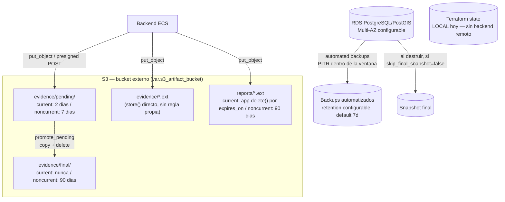

# S3 Lifecycle + Backup / Disaster Recovery — Fase 4C.5

Este documento describe lo que Fase 4C.5 creó como código en `infra/terraform/` (módulo `modules/s3_lifecycle`) y la estrategia de backup/DR completa de Territorio Electoral — parte ya implementada en Fase 4C.3 (RDS), parte solo documentada por ahora (procedimientos de restore, matriz de incidentes, RPO/RTO). Complementa [`TERRAFORM_FOUNDATION.md`](./TERRAFORM_FOUNDATION.md), [`ECS_ALB_FOUNDATION.md`](./ECS_ALB_FOUNDATION.md), [`RDS_PROXY_FOUNDATION.md`](./RDS_PROXY_FOUNDATION.md), [`WAF_CLOUDWATCH_FOUNDATION.md`](./WAF_CLOUDWATCH_FOUNDATION.md) y [`PRODUCTION_ARCHITECTURE.md`](./PRODUCTION_ARCHITECTURE.md). **Ningún recurso de AWS existe todavía** — no se ejecutó `terraform apply` ni `terraform plan`, y esta fase **no realiza ningún restore real**.

**Nota sobre `terraform validate` y las validaciones cruzadas de este documento** (§4, §21): `terraform validate` confirma que el HCL de abajo es sintácticamente válido y que los tipos son correctos, pero — verificado empíricamente en esta revisión con un harness aislado — **no evalúa una `validation` de variable de un módulo hijo contra el valor real que le pasa el módulo llamador** cuando ese valor solo es literal en el sitio de la llamada; usa el default de la propia variable. Las tres confirmaciones de ownership del §4 están razonadas manualmente (misma sintaxis ya usada y aceptada en `modules/observability` desde Fase 4C.4) y son sintácticamente válidas, pero su disparo real ante un intento de activación parcial solo puede confirmarse con `terraform plan`, prohibido en esta fase — ver §4 para el detalle.

## Diagrama



## 1. Auditoría del storage S3 existente (Fase 4A)

Revisión directa de `backend/app/services/artifact_storage.py`, `backend/app/services/artifact_storage_factory.py`, `backend/app/core/config.py` y los servicios que los usan — no se infirió ningún prefijo.

| Concepto | Valor real | Fuente |
| --- | --- | --- |
| Bucket | `settings.s3_artifact_bucket` (`S3_ARTIFACT_BUCKET`) — un único bucket para todo | `config.py:64` |
| Prefijo evidencia | `settings.s3_evidence_prefix`, default `"evidence"` | `config.py:65` |
| Prefijo informes | `settings.s3_report_prefix`, default `"reports"` | `config.py:66` |
| Quién crea el bucket | **Nadie, en este Terraform.** `modules/ecs/main.tf:110`: *"El bucket en si no es un recurso de este modulo todavia"* — confirmado también en esta fase (§4) | `modules/ecs/main.tf` |
| Encryption | SSE-S3 (`AES256`) por defecto, o SSE-KMS con `S3_KMS_KEY_ID` — enviado en cada `put_object`/`generate_presigned_post` (`_encryption_args()`) | `artifact_storage.py:196-200` |
| Versioning previo | No hay evidencia de que el bucket real tenga versioning — la aplicación no lo requiere ni lo verifica; `PRODUCTION_ARCHITECTURE.md` ya documentaba versioning como **target**, no como implementado | `PRODUCTION_ARCHITECTURE.md:57` |
| Lifecycle previo | Ninguno — explícitamente listado como pendiente en `PRODUCTION_ARCHITECTURE.md:60-61` | — |

### Prefijos reales y su ciclo de vida

`S3ArtifactStorage` tiene **dos rutas de escritura distintas**, y solo una de ellas usa `pending/`/`final/`:

| Servicio | Prefijo raíz | Ruta de escritura | Clave resultante | Naturaleza |
| --- | --- | --- | --- | --- |
| `election_act_service.py` (subida directa de actas) | `evidence/` | `new_pending_key` → `presign_upload` → (cliente sube) → `promote_pending` | `evidence/pending/{uuid}.ext` → `evidence/final/{uuid}.ext` | **Temporal → definitivo**. `promote_pending` es `copy_object` (pending→final) seguido de `delete_object` del pendiente — nunca al revés (`artifact_storage.py:305-317`) |
| `election_act_service.py` (otros flujos), `operational_service.py`, `election_day_service.py` | `evidence/` | `store()` (server-side, síncrono) | `evidence/{uuid}.ext` (raíz, sin subprefijo) | **Definitivo desde el primer instante** — nunca pasa por `pending/` |
| `report_service.py` | `reports/` | `store()` (server-side, síncrono) | `reports/{uuid}.ext` | **Definitivo desde el primer instante** |

**Consecuencia directa para el diseño de lifecycle (§6)**: una regla de expiración con prefijo `evidence/` (sin más) afectaría también a `evidence/final/` y a los objetos raíz `evidence/{uuid}.ext`, que **nunca deben expirar automáticamente**. Por eso la única regla de expiración incondicional de este módulo usa el prefijo exacto `evidence/pending/`, nunca `evidence/`.

Objetos "pending" abandonados solo pueden surgir del primer flujo (upload-intent de actas nunca completado — el cliente nunca sube el archivo, o lo sube pero nunca llama a `/evidence/complete`): son huérfanos por diseño, no referenciados por ninguna fila de base de datos (`artifact_storage.py:252-258`, docstring explícito: *"safe for a Fase 4C lifecycle rule to expire"*).

## 2-3. Separación de responsabilidades (no mezclar buckets)

| Tipo | Bucket/recurso | Administrado por | Estado en este stack |
| --- | --- | --- | --- |
| A. Artifacts (evidencia/actas/informes) | `var.s3_artifact_bucket` | Externo (no Terraform) | Configuración de lifecycle/versioning/encryption/PAB gestionada opcionalmente por `modules/s3_lifecycle` (§4) |
| B. Logs de infraestructura (ALB access logs) | `var.alb_access_logs_bucket` (Fase 4C.4) | Externo, bucket **dedicado**, distinto del de artifacts | Deshabilitado por defecto, nunca reutiliza el bucket A |
| C. Terraform state futuro | Ninguno todavía | N/A | Hoy el state es **local** (§28 Terraform state DR) — no existe un bucket S3 para esto en ningún `.tf` de este repo |
| D. Backups/snapshots de RDS | Gestión nativa de AWS (Secrets Manager para credenciales, snapshots internos de RDS) | AWS (vía `aws_db_instance`) | No usa S3 en absoluto — los snapshots de RDS viven en el namespace de snapshots de RDS, no en ningún bucket |

Ninguna de las cuatro responsabilidades se mezcla: el bucket de artifacts (A) nunca se reutiliza para (B), (C) ni (D), y esta fase no crea ningún recurso que las mezcle.

## 4. Ownership del bucket de artifacts

**El bucket sigue sin ser un recurso Terraform** (`aws_s3_bucket`) en ningún módulo de este stack — confirmado de nuevo en esta fase, no solo heredado de 4C.2. `var.s3_artifact_bucket` sigue siendo una variable de tipo `string`, provista externamente (`terraform.tfvars`), sin `resource "aws_s3_bucket"` en ningún `.tf`.

Dado que no existe una decisión de importar/crear el bucket, esta fase **no crea uno nuevo ni lo adopta como recurso completo**. En su lugar, `modules/s3_lifecycle` administra **únicamente configuración adjunta al bucket por nombre** — `aws_s3_bucket_versioning`, `aws_s3_bucket_lifecycle_configuration`, `aws_s3_bucket_server_side_encryption_configuration`, `aws_s3_bucket_public_access_block` — los cuatro son recursos independientes del AWS provider que toman `bucket = <nombre>` como argumento y **no requieren declarar `aws_s3_bucket`** para funcionar (verificado contra el schema real del provider AWS 5.100.0, `terraform providers schema -json`).

Esto es una forma segura y explícita (no un cambio silencioso de arquitectura) — pero activar cualquiera de los cuatro recursos convierte a este stack en el **owner real de esas configuraciones concretas**: `aws_s3_bucket_lifecycle_configuration` (igual que los otros tres) **reemplaza por completo** la lifecycle configuration existente del bucket para ese aspecto — no la fusiona con reglas creadas manualmente o por otro IaC. Por eso la activación exige **tres confirmaciones explícitas independientes**, no una sola variable:

| # | Variable (`environments/prod`) | Qué confirma | Default |
| --- | --- | --- | --- |
| 1 | `s3_lifecycle_management_enabled` | "Quiero que este módulo haga algo" | `false` |
| 2 | `s3_bucket_configuration_managed_by_this_stack` | "Confirmo que **ningún otro stack/IaC** administra hoy el versioning/lifecycle/encryption/public-access-block de ese bucket" | `false` |
| 3 | `s3_bucket_dedicated_to_project` | "Confirmo que ese bucket está **dedicado exclusivamente** a Territorio Electoral, no compartido con otros proyectos/workloads" | `false` |

Las tres deben ser `true` simultáneamente — `modules/s3_lifecycle/variables.tf` lo impone con una `validation` en la variable `enabled` que referencia a las otras dos (`!var.enabled || (var.bucket_configuration_managed_by_this_stack && var.bucket_dedicated_to_project)`), y `main.tf` repite la misma condición de forma redundante en `local.manage` para que ningún recurso dependa de una sola variable ni siquiera indirectamente. Cambiar una sola de las tres nunca activa nada.

**Límite de verificación de esta revisión**: se confirmó con un harness aislado que `terraform validate` **no dispara** esta `validation` cuando el valor de `enabled` llega como literal desde el módulo llamador (usa el default de la propia variable en su lugar) — limitación conocida de `validate` frente a `plan` para validaciones cruzadas entre variables de un módulo hijo. La sintaxis es idéntica a la ya usada y aceptada en `modules/observability` (Fase 4C.4, `create_alarm_sns_topic`/`alarm_sns_topic_arn`) y es correcta por inspección manual, pero su disparo real solo puede confirmarse con `terraform plan`, prohibido en esta fase.

- **Qué implica activar las tres**: este stack pasaría a administrar la *configuración* del bucket (versioning, reglas de lifecycle, encryption por defecto, public access block) — nunca su existencia. `terraform destroy` sobre este stack destruiría esos cuatro recursos de configuración (el bucket volvería a sus valores por defecto de AWS), **nunca el bucket en sí ni sus objetos**, porque `aws_s3_bucket` nunca se declara.
- **Qué NO se implementa por esta razón**: una `aws_s3_bucket_policy` (§11 abajo) — a diferencia de los cuatro recursos anteriores, una bucket policy es un documento único por bucket; si el verdadero propietario del bucket ya tiene una policy propia, que Terraform la gestionara la sobrescribiría silenciosamente. Se documenta como requisito externo en vez de codificarse.
- **Bucket dedicado**: no puede comprobarse técnicamente desde este Terraform (el bucket es externo) — `s3_bucket_dedicated_to_project` es la confirmación explícita que sustituye esa comprobación. Además de gatear la activación completa, es el prerequisito que justifica que las dos reglas bucket-wide del módulo (§8) no estén acotadas por prefijo.
- **Si otro stack ya administra alguna de estas configuraciones**: debe resolverse el ownership primero (migrar esa configuración a este módulo, o mantenerla donde está y no activar `s3_lifecycle_management_enabled`) — este módulo nunca intenta fusionarse con configuración existente de otro origen.

## 5. Semántica de `expiration` con S3 Versioning

Con `s3_versioning_enabled = true` (default), una acción `expiration.days` sobre un objeto **CURRENT** (la "versión visible" de una clave) **nunca borra bytes de inmediato**. La secuencia real es:

1. **Día 0**: el objeto es la versión current, visible normalmente (`GetObject`/`ListObjects` lo devuelven).
2. **Al cumplirse `expiration.days`**: S3 inserta un **delete marker** como nueva versión current — la clave "deja de existir" para operaciones normales (`GetObject` devuelve 404), pero la versión anterior **no se borra**: pasa a ser una **versión noncurrent**, con los bytes intactos.
3. **La versión noncurrent** queda gobernada desde ese momento por la regla `noncurrent_version_expiration` correspondiente a su prefijo (§6) — **no** por la regla de `expiration` que la generó.
4. **Borrado físico definitivo**: ocurre recién cuando esa versión noncurrent cumple su propio `noncurrent_days` — es decir, el tiempo total hasta el borrado físico real es `expiration.days` (current → delete marker) **más** el `noncurrent_days` de esa versión (noncurrent → borrado real), no solo el primero.

Consecuencia directa para `evidence/pending/`: describir esto como *"el objeto se elimina a los 2 días"* sería incorrecto con versioning activo — lo correcto es *"a los 2 días deja de ser visible (delete marker); los bytes permanecen hasta 7 días adicionales como versión noncurrent (`pending_noncurrent_expiration_days`), borrándose físicamente alrededor del día 9"*. Sin versioning (`s3_versioning_enabled = false`), sí sería exacto decir que se borra físicamente a los 2 días — `expiration.days` sobre un bucket sin versionar es un borrado directo, sin delete marker.

## 6. Reglas de lifecycle por prefijo — una política por ciclo de vida real, sin solapamientos

Cada prefijo real tiene su **propia** política de expiración/transición current y su **propia** retención noncurrent — deliberadamente **no** una única regla global de `noncurrent_version_*` bucket-wide, porque `evidence/pending/`, `evidence/final/` y `reports/` tienen ciclos de vida completamente distintos (ver §5 sobre por qué esto importa: sin esta separación, un pending compartiría la misma retención noncurrent larga que la evidencia definitiva). Las únicas reglas sin `filter.prefix` acotado son las dos bucket-wide de §8, y por una razón explícita y distinta (dedicación del bucket, no ciclo de vida).

| Regla (`aws_s3_bucket_lifecycle_configuration.this[0].rule`) | Prefijo | Acciones | Variables |
| --- | --- | --- | --- |
| `pending-cleanup` | `{evidence_prefix}/pending/` | `expiration.days` (incondicional) + `noncurrent_version_expiration` (si versioning) | `s3_pending_expiration_days` (default **2**), `s3_pending_noncurrent_expiration_days` (default **7**) |
| `evidence-final-lifecycle` | `{evidence_prefix}/final/` | `transition` opcional + `noncurrent_version_transition` opcional + `noncurrent_version_expiration` (si versioning) — **sin `expiration`, nunca** | `s3_evidence_final_transition_*` (default deshabilitada), `s3_evidence_final_noncurrent_*` (default 30d→IA, 90d expiración) |
| `reports-lifecycle` | `{report_prefix}/` | `expiration` opcional + `transition` opcional + `noncurrent_version_transition` opcional + `noncurrent_version_expiration` (si versioning) | `s3_reports_expiration_days` (default **0**, ver "Auditoría de retención real de reports" abajo), `s3_reports_transition_*`, `s3_reports_noncurrent_*` (default 30d→IA, 90d expiración) |
| `expired-delete-marker-cleanup` | todo el bucket (`""`) | `expiration.expired_object_delete_marker = true` | `s3_expired_delete_marker_cleanup_enabled` (default `true`, solo con versioning) |
| `abort-incomplete-multipart-upload` | todo el bucket (`""`) | `abort_incomplete_multipart_upload.days_after_initiation` | `s3_abort_incomplete_multipart_upload_days` (default **7**) |

Las reglas `evidence-final-lifecycle` y `reports-lifecycle` se omiten por completo (vía `dynamic "rule"`) si ninguna de sus acciones internas aplicaría — evita que Terraform intente crear una `rule` sin ninguna acción, que AWS rechaza (rechazado y corregido en esta misma revisión antes de cualquier intento de `apply`).

**Por qué `evidence/pending/` usa una retención noncurrent mucho más corta (7 días) que `evidence/final/`/`reports/` (90 días cada uno)**: un upload-intent nunca completado (§1) nunca tuvo valor de recuperación operativo/auditable — no tiene sentido conservar sus versiones noncurrent con la misma ventana orientada a recuperación que usa evidencia definitiva o informes ya generados. `s3_pending_noncurrent_expiration_days` está además validado (`variables.tf`) para que nunca pueda ser mayor que `s3_evidence_final_noncurrent_expiration_days`. Sin transición a `STANDARD_IA` para las versiones noncurrent de pending: 7 días es menor que el mínimo de 30 días que exige esa clase, transicionar antes no tendría sentido económico.

**Por qué `evidence/{uuid}.ext` (raíz, vía `store()` directo) no tiene regla propia**: esos objetos son tan definitivos como `evidence/final/*`, pero no comparten prefijo con ellos — capturarlos exigiría un prefijo `evidence/` que volvería a incluir `evidence/pending/`, reintroduciendo el solapamiento que este diseño evita deliberadamente. Quedan **sin regla de expiración ni de noncurrent expiration** — el resultado es conservador (nunca se borran automáticamente, igual que `evidence/final/`), documentado como limitación deliberada (§34), no resuelto con una regla más compleja para mantener el diseño simple y sin solapamientos ambiguos.

### Auditoría de retención real de reports — corregida, `reports_expiration_days` se mantiene en `0`

Revisión directa del código, no supuesta. La aplicación tiene **dos mecanismos** para retirar un `ReportArtifact`, ambos ahora correctos y **backend-aware** (respetan `ARTIFACT_STORAGE_PROVIDER` por igual, local o S3):

| Mecanismo | Dónde | Qué hace con el objeto físico |
| --- | --- | --- |
| **Desactivación manual** (`ReportService.deactivate`, admin) | `report_service.py:226-231` | Llama a `self.storage.delete(artifact.storage_key)` sobre el `storage` inyectado, construido vía `artifact_storage_factory.build_report_storage()` — probado explícitamente contra S3 en `tests/test_report_storage_s3_regression.py::test_report_lifecycle_with_s3_provider` |
| **Limpieza automática por fecha** (`ReportArtifact.expires_on` vencido) | `backend/app/scripts/cleanup_generated_reports.py` | Construye su storage con `artifact_storage_factory.build_report_storage()` — la misma fábrica, la misma fuente de verdad que usa `ReportService` — en vez de instanciar un backend hardcodeado |

**Defecto encontrado y corregido en esta revisión**: `cleanup_generated_reports.py` construía `LocalReportStorage(settings.report_output_dir, ...)` **directamente**, sin pasar por la factory ni consultar `settings.artifact_storage_provider`. En modo `ARTIFACT_STORAGE_PROVIDER=s3` (el target de producción, Fase 4C), `storage.delete("reports/{uuid}.pdf")` intentaba resolver esa cadena como ruta de archivo local (inexistente), `LocalArtifactStorage.delete()` devolvía `False` sin lanzar excepción, y el script marcaba `artifact.is_available = False` de todas formas — reportando el artefacto como "removido" sin haber borrado nada en S3. **Corrección aplicada**: el script ahora llama a `artifact_storage_factory.build_report_storage()` — cero lógica de selección de provider duplicada, cero cliente boto3 propio, cero manejo de prefijos propio; reutiliza exactamente la misma fábrica que ya usa `ReportService`. Se amplió además el manejo de errores (`except ValueError` → `except Exception`, con `logger.warning`) para que un error real de S3 (permisos, red) durante la limpieza no aborte todo el lote silenciosamente sin registrar nada — mismo patrón `except Exception` que ya usaba `ReportService.generate()` para su propia limpieza de huérfanos (`report_service.py:173-174`). Probado en `tests/test_cleanup_generated_reports.py` (4 tests: selección de provider local/S3, no-touch de un reporte aún vigente, y manejo de fallo de `delete()`) — los dos tests específicos de S3 **fallan** deliberadamente contra la implementación anterior (confirmado revirtiendo temporalmente el script durante esta misma revisión) y **pasan** contra la corregida.

**Estado resultante de `s3_reports_expiration_days` — se mantiene en `0`, ahora por la razón correcta**: con el defecto corregido, la aplicación vuelve a ser el mecanismo primario de expiración lógica **y física** para `reports/`, en ambos backends. Añadir una expiración `current` de S3 lifecycle sería una segunda expiración redundante, exactamente lo que este documento evita (§10 del checklist original de Fase 4C.5: *"No agregues una segunda expiración current de 30 días únicamente para duplicar la lógica de aplicación"*). S3 lifecycle sobre `reports/` se concentra, como estaba previsto, en recuperación/versioning, limpieza de versiones noncurrent y transiciones opcionales de storage class — nunca en repetir la expiración `current` que la aplicación ya hace correctamente.

**Retención resultante — ejemplo conceptual, no un SLA**: con `report_artifact_retention_days = 30` (default de aplicación) y `s3_reports_noncurrent_expiration_days = 90` (default de este módulo, §6):

1. Un `ReportArtifact` se genera; `expires_on = report_date + 30 días`.
2. Al llegar `expires_on`, `cleanup_generated_reports.py` (ejecutado periódicamente, hoy de forma manual — ver `README.md`) identifica el artefacto vencido y llama `storage.delete(...)` sobre el backend real — esto es la **retención lógica/de aplicación**: a partir de aquí, la API dejó de considerar ese artefacto disponible.
3. Con S3 Versioning activo (§5), ese `delete()` sin `VersionId` explícito no borra bytes: inserta un delete marker (la clave deja de ser "visible") y la versión previa pasa a **noncurrent** — la **retención física/de recuperación S3** empieza aquí, no en el paso 1.
4. Esa versión noncurrent permanece recuperable (§25, procedimiento de restore S3) durante `s3_reports_noncurrent_expiration_days` = 90 días adicionales desde que se volvió noncurrent.
5. Pasado ese período, la regla `noncurrent_version_expiration` de la lifecycle configuration la borra físicamente de forma definitiva.

**No leer el paso 5 como "el objeto desaparece al segundo exacto del día 120"**: las acciones de S3 Lifecycle se evalúan una vez por día calendario (UTC) de forma asíncrona, no en el instante exacto en que se cumple el plazo — un objeto puede persistir hasta ~24-48h más allá del umbral configurado antes de que S3 procese la regla, comportamiento documentado por AWS, no un defecto de esta configuración. Sin S3 Versioning (`s3_versioning_enabled = false`), el paso 3 no aplica: el `delete()` del paso 2 es un borrado físico directo, sin ventana de recuperación adicional.

## 7. Delete markers huérfanos

`expired-delete-marker-cleanup` (default activa, solo con versioning, bucket-wide): limpia marcadores de borrado que quedaron como la única "versión" de una clave una vez que todas sus versiones reales ya expiraron (§5-6) — sin esto, esos marcadores se acumulan indefinidamente sin contenido que recuperar.

## 8. Alcance de multipart cleanup y delete marker cleanup — por qué son bucket-wide

`abort-incomplete-multipart-upload` y `expired-delete-marker-cleanup` son las **únicas** reglas de este módulo sin `filter.prefix` acotado. Dado que el bucket es externo, esto podría abortar multipart uploads de workloads ajenos si el bucket fuera compartido — **por eso su alcance bucket-wide está condicionado, igual que el resto del módulo, a `s3_bucket_dedicated_to_project = true` (§4)**: activar el módulo en absoluto ya exige esa confirmación explícita, así que en el momento en que cualquiera de estas dos reglas llega a crearse, la dedicación exclusiva del bucket ya está confirmada por definición. No se dividieron en reglas separadas por prefijo (`evidence/`, `reports/`) porque, con esa confirmación como prerequisito obligatorio de todo el módulo, hacerlo añadiría complejidad sin beneficio real — evidencia adicional de la decisión, no una suposición.

## 9. Encryption S3

Dos capas independientes, ambas documentadas para no confundirlas, y ambas sujetas al mismo gate de ownership de §4 (activar la capa 2 también convierte a este stack en owner de esa configuración concreta del bucket):

1. **Por objeto** (ya implementado, Fase 4A): cada `put_object`/`generate_presigned_post` envía `ServerSideEncryption`/`x-amz-server-side-encryption` explícito (`artifact_storage.py:196-200,274-279`) — `AES256` por defecto, o `aws:kms` con `S3_KMS_KEY_ID`.
2. **Por defecto del bucket** (nuevo en esta fase, opcional): `aws_s3_bucket_server_side_encryption_configuration`, gestionado si `s3_default_encryption_enabled = true` (default) — solo si el gate de §4 está activo. Defensa en profundidad — cubre cualquier objeto escrito sin ese header (ej. una subida manual vía consola/CLI que no lo especifique).

**No se migra a SSE-KMS por defecto** en esta fase — `AES256` ya cumple la arquitectura actual. Cambiar a una CMK dedicada (`s3_lifecycle_sse_mode = "aws:kms"` + `s3_lifecycle_kms_key_id`) queda documentado como opción futura si un requisito de cumplimiento concreto lo exige — no se crea ninguna CMK especulativamente.

## 10. Public Access Block

`aws_s3_bucket_public_access_block`, gestionado si `s3_public_access_block_enabled = true` (default) — sujeto al mismo gate de ownership de §4: las 4 protecciones activas (`block_public_acls`, `block_public_policy`, `ignore_public_acls`, `restrict_public_buckets`). Los uploads/downloads directos usan exclusivamente URLs firmadas (`S3ArtifactStorage.download`/`presign_upload`) — el bucket nunca necesita, ni debe, ser público. Igual que la encryption por defecto (§9), este stack no debe competir con otro IaC por este recurso — de ahí que dependa de las mismas tres confirmaciones, no de una variable de activación propia e independiente.

## 11. SecureTransport (TLS) — deferido, no implementado

Por la razón documentada en §4 (una bucket policy es un documento único por bucket, y este stack no tiene ownership confirmado del bucket), **no se crea ningún `aws_s3_bucket_policy`** en esta fase. Referencia de la policy recomendada, a aplicar manualmente o por quien administre el bucket, una vez confirmado el ownership — placeholder, nunca un bucket real:

```json
{
  "Version": "2012-10-17",
  "Statement": [{
    "Sid": "DenyInsecureTransport",
    "Effect": "Deny",
    "Principal": "*",
    "Action": "s3:*",
    "Resource": ["arn:aws:s3:::<bucket>", "arn:aws:s3:::<bucket>/*"],
    "Condition": { "Bool": { "aws:SecureTransport": "false" } }
  }]
}
```

## 12. Object Lock — deferido, no habilitado

Object Lock (WORM) solo puede activarse **al crear el bucket** — no es retroactivo. Como este stack no crea el bucket (§4), Object Lock queda fuera de alcance mientras esa decisión de ownership no cambie. Además, no existe hoy un requisito confirmado de retención legal/regulatoria (WORM) para Territorio Electoral que lo justifique — se documenta como opción futura, condicionada a: (a) que el equipo decida que Terraform cree el bucket desde cero, y (b) que exista un requisito legal/regulatorio explícito. No se activa por defecto ni especulativamente.

## 13. Transiciones de storage class — resumen

| Storage class | Retrieval | Mínimo de permanencia | Uso en este diseño |
| --- | --- | --- | --- |
| `STANDARD` | Milisegundos | — | Default para todo objeto nuevo |
| `STANDARD_IA` | Milisegundos (igual que STANDARD) | 30 días | Única clase usada — evidencia final/informes (opcional, deshabilitado por defecto) y noncurrent versions |
| `GLACIER`/`GLACIER_IR`/`DEEP_ARCHIVE` | Minutos a horas (requiere restore previo) | 90-180 días | **No usado** — evidencia electoral y informes pueden necesitarse con poca antelación (auditorías, reclamos, verificación de actas); el ahorro adicional frente a `STANDARD_IA` no compensa el riesgo de una recuperación lenta en ese contexto |

Cadena deliberadamente simple (un único salto opcional a `STANDARD_IA`) — no se implementa una cadena de transiciones más compleja solo porque AWS la permite. Los días mínimos (30) están validados en `variables.tf` para las cuatro variables de transición current y las cuatro de transición noncurrent, coincidiendo con el mínimo real que exige `STANDARD_IA`. Todas las transiciones (current y noncurrent) permanecen **deshabilitadas por defecto** — activarlas es una decisión explícita posterior, no tomada por este documento. **Advertencia económica, no automatizada por Terraform**: `STANDARD_IA` cobra un mínimo de tamaño facturable por objeto (128 KB) y un cargo por GB de retrieval — transicionar objetos pequeños (miniaturas, documentos cortos) o de acceso frecuente (evidencia consultada activamente durante una jornada electoral) podría costar más de lo que ahorra; quien active `evidence_final_transition_enabled`/`reports_transition_enabled` debe evaluar el patrón de acceso real de esos objetos antes de hacerlo, no solo el tiempo transcurrido.

## 14. Backup RDS — auditoría de lo ya existente (Fase 4C.3)

Ya implementado, sin duplicar nada en esta fase:

| Configuración | Valor/default | Dónde |
| --- | --- | --- |
| `backup_retention_period` | Configurable, **default 7 días** (nunca 0 en producción) | `modules/database/variables.tf:80-84` |
| `backup_window` | Configurable, `null` = AWS elige automáticamente | `modules/database/variables.tf:86-90` |
| `maintenance_window` | Configurable, `null` = AWS elige automáticamente | `modules/database/variables.tf:92-96` |
| `deletion_protection` | Configurable, **default `true`** | `modules/database/variables.tf:98-102` |
| `skip_final_snapshot` | Configurable, **default `false`** (crea snapshot final al destruir) | `modules/database/variables.tf:104-108` |
| `final_snapshot_identifier` | Fijo, estable: `"${name_prefix}-db-final-snapshot"` (sin `timestamp()`, evita diffs perpetuos) | `modules/database/main.tf:60-66` |
| `multi_az` | Configurable, default `false` (decisión de costo diferida) | `modules/database/variables.tf:110-114` |
| `storage_encrypted` | **Siempre `true`**, no es variable — invariante de seguridad | `modules/database/main.tf:33` |
| Credenciales | `manage_master_user_password = true` (Secrets Manager gestionado por AWS) + secreto de aplicación con `ephemeral`/write-only (Fase 4C.3) | `modules/database/main.tf` |

## 15-16. Automated backups y retención

`backup_retention_period` es configurable con default **7 días** — nunca `0` (deshabilitaría los backups automatizados). Rango permitido por RDS: 0-35 días; 0 solo es válido si se desea deshabilitar explícitamente, lo cual **no es el comportamiento por defecto de este stack** en ningún entorno de producción.

## 17. Point-in-Time Recovery (PITR)

Los backups automatizados de RDS habilitan PITR dentro de la ventana de `backup_retention_period` (hoy, hasta 7 días atrás por defecto — configurable). Aclaraciones importantes:

- **Qué se puede restaurar**: cualquier punto en el tiempo dentro de la ventana de retención, con granularidad de segundos (AWS aplica los transaction logs sobre el snapshot base más cercano).
- **La restauración crea una instancia NUEVA** — nunca sobrescribe la instancia existente in situ. El endpoint de la instancia restaurada es distinto al de la instancia original.
- **Pasos de reconexión posteriores** requeridos tras cualquier restore (ver §25 procedimiento completo): actualizar el target de RDS Proxy (o crear uno nuevo) para que apunte a la instancia restaurada, validar PostGIS/schema, y solo entonces permitir que la aplicación la use.

No se realiza ningún restore real en esta fase.

## 18. Final snapshot

`skip_final_snapshot = false` en producción (default ya correcto desde 4C.3, reconfirmado aquí). Al destruir la instancia (`terraform destroy` o eliminación manual), RDS crea un snapshot con el identificador estable `"${name_prefix}-db-final-snapshot"`. **Limitación documentada**: si esta instancia llegara a eliminarse y recrearse bajo el mismo `name_prefix`, un segundo intento de destrucción produciría un snapshot con el mismo nombre, lo cual falla por colisión — caso extremo, no resuelto con `timestamp()` porque eso produciría un diff de Terraform en cada `plan` sin cambios reales (`modules/database/main.tf:60-65`).

**Alternativa evaluada y descartada en esta revisión**: un sufijo estable generado por Terraform (`resource "random_id"`, guardado en el state) para reemplazar `timestamp()` sin producir diffs perpetuos. Se descarta porque **no resuelve el escenario real**: un `random_id` sin `keepers` se genera una única vez y permanece invariable en el state durante todo el ciclo de vida del módulo — sobrevive exactamente igual que el propio nombre estable a un `destroy`/`recreate` de `aws_db_instance.this` (son recursos independientes, destruir uno no destruye el otro), por lo que un segundo `destroy` produciría el mismo sufijo que el primero y la colisión persistiría igual. Atarlo con `keepers` a algo que cambie en ese escenario exigiría una señal que hoy no existe en la configuración (nada cambia entre un `destroy`+`apply`+`destroy` con el mismo `name_prefix` y las mismas variables) — añadir esa señal artificialmente sería más frágil que el problema que resuelve. Se mantiene el identificador estable actual, **sin cambio de código**, y el riesgo queda marcado explícitamente como **requisito operativo previo a cualquier `destroy` real**: verificar manualmente que no exista ya un snapshot con el identificador `"${name_prefix}-db-final-snapshot"` en AWS (de un ciclo `destroy` anterior) antes de destruir de nuevo — si existe, renombrarlo/archivarlo/eliminarlo manualmente primero.

## 19. Snapshots manuales / AWS Backup — deferido, no implementado

No es responsabilidad de un recurso estático de Terraform crear snapshots periódicos (no existe ningún mecanismo de "cron" dentro de Terraform, y no se inventa uno). Se evaluó incorporar **AWS Backup** (`aws_backup_vault`/`aws_backup_plan`/`aws_backup_selection`) para centralizar política de retención sobre RDS — **se difiere, no se implementa en esta fase**, porque:

- Los backups automatizados de RDS (§14-17) ya cubren PITR dentro de una ventana configurable.
- El snapshot final al destruir (§18) ya cubre el caso de eliminación deliberada.
- AWS Backup añadiría un vault, un plan y una policy IAM adicional que **duplicarían** mecanismos ya cubiertos, sin una necesidad concreta identificada todavía (ej. retención centralizada multi-servicio, backups inmutables con vault lock, o una ventana de retención mayor a 35 días que RDS automatizado no soporta).
- Coherente con la filosofía ya establecida del proyecto (`PRODUCTION_ARCHITECTURE.md`, *"Lo que Fase 4C decide, no antes"*): no se introduce infraestructura adicional por anticipación, sin evidencia de necesidad real.

Si en el futuro surge un requisito concreto (retención > 35 días, vault lock/WORM para backups de RDS, o centralización de política de backup entre múltiples recursos), AWS Backup debe evaluarse en ese momento — no se implementa especulativamente aquí, y no se inventa su sintaxis Terraform sin haber verificado el schema real primero.

## 20. Cross-region DR — deferido, no implementado

La arquitectura completa (VPC, ALB, ECS, RDS, WAF) vive en una única región (`var.aws_region`, default `us-east-1`) — no existe ninguna segunda región productiva en ningún `.tf` de este repo, y esta fase no la introduce. Fallos cubiertos hoy vs. no cubiertos:

| Escenario | Cubierto hoy | Mecanismo |
| --- | --- | --- |
| Fallo de una AZ | Sí (si `multi_az=true`) / parcial (si `multi_az=false`, hay downtime hasta reemplazo) | RDS Multi-AZ, ALB multi-AZ, ECS tasks distribuidas en `app_subnet_ids` (2+ AZ) |
| Fallo de una instancia RDS | Sí | Failover automático (Multi-AZ) o restore desde backup/snapshot |
| Fallo lógico (bug, borrado accidental de datos) | Parcial | PITR (§17), versioning S3 (§6) — ninguno es instantáneo |
| Corrupción de datos | Parcial | PITR a un punto anterior a la corrupción, si se detecta dentro de la ventana de retención |
| **Fallo regional completo** | **No cubierto** | Ninguna réplica cross-region existe — el RTO de este escenario es indefinido hasta que se tome una decisión de costo/arquitectura explícita |

No se implementa cross-region automáticamente — es una decisión de costo que el equipo debe tomar explícitamente (una réplica de lectura cross-region de RDS, o AWS Backup con `copy_action` hacia otra región, son las opciones estándar si se decide abordar esto).

**Declaración explícita, sin maquillaje**: la arquitectura actual es **single-region**. Un fallo regional completo **no tiene recuperación automatizada garantizada** — no existe ningún mecanismo en este stack (Terraform, aplicación, o AWS-nativo) que restaure el servicio en otra región. El RTO de ese escenario es **indefinido** bajo la arquitectura actual — no "largo" ni "por confirmar en minutos", sino sin ningún objetivo definido porque no hay ningún mecanismo que lo produzca. Cross-region backups/replication es una decisión posterior, explícita, de costo y criticidad de negocio — no un roadmap implícito de esta fase ni de ninguna anterior.

## 21. Multi-AZ ≠ Backup

Distinción explícita, con frecuencia confundida:

- **Multi-AZ** protege **disponibilidad** ante ciertos fallos de infraestructura (fallo de instancia, de AZ, de storage subyacente) mediante un standby síncrono con failover automático (típicamente < 1-2 minutos, sin intervención manual). **No protege contra un error lógico** — un `DELETE` erróneo o una migración defectuosa se replica igual de rápido al standby.
- **Backups/snapshots/PITR** protegen **recuperación de datos** ante errores lógicos, corrupción, o borrado accidental — a costa de un RTO mayor (crear una instancia nueva desde un punto en el tiempo, reconectar RDS Proxy, validar).

Ambos mecanismos son complementarios, no sustitutos entre sí. Este stack ya tiene ambos disponibles como variables independientes (`multi_az`, `backup_retention_period`).

## 22. RPO (Recovery Point Objective) — objetivo técnico inicial, no SLA

| Escenario | RPO objetivo | Derivado de |
| --- | --- | --- |
| Fallo de AZ (con `multi_az=true`) | ~0 (replicación síncrona) — sin pérdida de datos confirmados por el motor | Mecanismo de failover síncrono de RDS Multi-AZ |
| Restauración vía PITR | Hasta el segundo más reciente antes del incidente, dentro de la ventana de `backup_retention_period` | Capacidad nativa de PITR de RDS |
| Restauración desde snapshot manual | El momento exacto del snapshot (pérdida de todo lo posterior) | Snapshots son puntuales, no continuos |
| Objetos S3 (evidencia/informes) con versioning | ~0 para overwrite/delete (versión anterior recuperable) — **sin protección** si el objeto nunca tuvo una versión anterior o si versioning nunca estuvo activo | `aws_s3_bucket_versioning` (§6) |

Estos son objetivos técnicos derivados de los mecanismos configurados — **no una promesa comercial ni un SLA contractual**. No se inventan cifras no derivadas de un mecanismo real.

## 23. RTO (Recovery Time Objective) — objetivo técnico aproximado, "por validar" donde no hay medición

| Escenario | RTO objetivo | Estado |
| --- | --- | --- |
| Fallo de una task ECS | Segundos a ~1-2 minutos (reemplazo automático por el ECS Service + health check del ALB) | **Por validar** — nunca medido en este proyecto |
| Fallo de AZ (con `multi_az=true`) | Minutos (failover automático de RDS Multi-AZ, típicamente 60-120s según documentación de AWS) | **Por validar** — cifra de AWS, no medida en este entorno |
| Restauración PITR | Depende del tamaño de la base de datos y de cuántos transaction logs deben aplicarse — puede ir de minutos a horas | **Por validar** — sin medición real |
| Restauración completa desde snapshot | Similar a PITR, más el tiempo de reconfigurar RDS Proxy/aplicación | **Por validar** |
| Región completa no disponible | Indefinido — sin mecanismo cross-region (§20) | **No aplicable hasta que exista una estrategia cross-region** |

Ninguna cifra de minutos exactos se inventa para los escenarios nunca medidos — quedan marcados explícitamente como "por validar". La medición real (ejercicios de DR con tiempos cronometrados) es trabajo futuro, fuera de alcance de esta fase.

## 24. Matriz de incidentes

| Escenario | Prevención | Detección | Recuperación | Fuente de backup | RPO | RTO | Limitaciones |
| --- | --- | --- | --- | --- | --- | --- | --- |
| Objeto S3 eliminado | IAM mínimo (`s3:DeleteObject` solo para el Task Role, sin acceso público) | Aplicación (fila de DB referenciando una key que ya no existe) o auditoría manual | Recuperar versión anterior al delete marker (§6, §25) | Versioning S3 | ~0 si versioning estaba activo | Minutos (operación manual, sin automatizar) | Sin protección si versioning nunca estuvo activo para ese objeto |
| Objeto S3 sobrescrito | — | Comparación de `sha256`/`size_bytes` en DB vs. `head_object` real | Recuperar versión noncurrent anterior (§25) | Versioning S3 | ~0 | Minutos | Igual limitación que arriba |
| Upload pending abandonado | — | N/A (por diseño, se limpia solo) | Automática | Lifecycle rule `pending-cleanup` (§6) | N/A (nunca fue definitivo) | 0 (automático) | Ninguna — es el caso ya cubierto por diseño |
| Datos borrados por error en DB | Constraints/transacciones a nivel de aplicación | Alertas de aplicación, reporte de usuario | PITR a un punto anterior al `DELETE` | RDS automated backups | Hasta el segundo, dentro de la ventana de retención | Por validar (§23) | Restaura TODA la base de datos a ese punto — no un borrado selectivo de una sola tabla/fila |
| Corrupción lógica de DB | Migraciones probadas en CI antes de producción | Errores de aplicación, `pg_dump`/checks manuales | PITR a un punto anterior a la corrupción | RDS automated backups | Igual que arriba | Por validar | Igual que arriba |
| Fallo de instancia RDS | Multi-AZ (opcional, `var.db_multi_az`) | CloudWatch alarm `rds-cpu`/health checks de RDS | Failover automático (Multi-AZ) o restore desde snapshot | RDS Multi-AZ / snapshots | ~0 (Multi-AZ) o el punto del snapshot | Por validar | Sin Multi-AZ, downtime hasta que AWS reemplace la instancia |
| Fallo de AZ | Subredes/ALB/ECS multi-AZ (Fase 4C.1-4C.2), RDS Multi-AZ opcional | CloudWatch alarms (ALB unhealthy hosts, RDS) | Automática para ECS/ALB; automática para RDS solo con Multi-AZ | Infraestructura redundante ya desplegada en 2+ AZ | ~0 | Por validar | Con `single_nat_gateway=true`, la salida a Internet de las subredes `app` de esa AZ se pierde (el VPC Endpoint S3 sigue funcionando) |
| Fallo regional | Ninguna (§20) | — | Ninguna implementada | — | Indefinido | Indefinido | Sin estrategia cross-region — decisión de costo pendiente |
| Credencial comprometida | Secrets Manager (nunca credenciales estáticas), IAM least-privilege, `S3ArtifactStorage`/RDS Proxy sin claves hardcodeadas | CloudTrail (no configurado explícitamente en este stack todavía), rotación manual | Rotar el secreto afectado (`db_app_secret_version++` + `apply` + reinvocar bootstrap task para RDS; regenerar/rotar el secreto de AWS para el usuario maestro) | Secrets Manager | N/A | Minutos a horas (proceso manual, documentado en `RDS_PROXY_FOUNDATION.md`, "Rotación futura") | Sin rotación automática en esta fase |
| Despliegue defectuoso | CI (backend/compose/e2e/frontend, ver Fase 4C.1-4C.4), imágenes inmutables por digest/tag de commit (§29) | Health checks de ALB/ECS, CloudWatch alarms (Fase 4C.4) | Rollback a la task definition/imagen anterior (`aws ecs update-service` con el `task_definition` previo, o `backend_migrate_task_definition_arn` de una revisión anterior) | Task definitions anteriores (ECS conserva un historial) | N/A | Minutos (rollback manual) | Sin ECR lifecycle todavía (§29) — depende de que la imagen anterior siga existiendo en el registry |

## 25. Procedimiento de restore S3

**Ninguno de estos comandos se ejecuta en esta fase.** Ejemplos con placeholders seguros, nunca un bucket/account ID real.

**Recuperar una versión anterior (overwrite accidental)**:
```
aws s3api list-object-versions --bucket <bucket> --prefix <key>
aws s3api get-object --bucket <bucket> --key <key> --version-id <version-id> <archivo-local>
# Para restaurar como version "actual": copiar esa version sobre si misma
aws s3api copy-object --bucket <bucket> --copy-source "<bucket>/<key>?versionId=<version-id>" --key <key>
```

**Recuperar un objeto eliminado (delete marker)**:
```
aws s3api list-object-versions --bucket <bucket> --prefix <key>
# Identificar el DeleteMarker mas reciente y su version-id, luego eliminarlo
# (esto "revive" la version anterior como version actual)
aws s3api delete-object --bucket <bucket> --key <key> --version-id <delete-marker-version-id>
```

**Recuperar un objeto en storage class archival** (solo si se activaron las transiciones opcionales del §13 hacia `STANDARD_IA` — `STANDARD_IA` no requiere restore previo, se lee directo; este paso solo aplicaría si en el futuro se decidiera transicionar a `GLACIER`, lo cual esta fase no hace):
```
aws s3api restore-object --bucket <bucket> --key <key> --restore-request '{"Days":7}'
```

## 26. Procedimiento de restore RDS PITR

Conceptual — **no se ejecuta nada en esta fase**:

1. Identificar el punto de recuperación deseado (timestamp UTC, dentro de la ventana de `backup_retention_period`).
2. Restaurar a una **instancia RDS nueva** (`aws rds restore-db-instance-to-point-in-time`) — nunca sobrescribe la instancia original, que permanece intacta para investigación (§32).
3. Validar que la extensión PostGIS está presente y con la versión esperada (§28).
4. Validar el schema (comparar contra el estado esperado por Alembic — `alembic current`/`alembic history` contra la instancia restaurada).
5. Ejecutar checks funcionales básicos (consultas de salud, conteos de tablas clave).
6. Actualizar el target de RDS Proxy (§27) para apuntar a la instancia restaurada — nunca conectar el backend directamente al endpoint RDS.
7. Validar la aplicación completa contra la instancia restaurada (entorno aislado, no producción, hasta confirmar integridad).
8. Cambiar tráfico/configuración de producción hacia la instancia restaurada, solo tras validar los pasos anteriores.
9. Preservar la instancia original (no eliminarla inmediatamente) para investigación post-incidente.

## 27. Procedimiento de restore desde snapshot

Conceptual — **no se ejecuta nada en esta fase**. Igual que PITR (§26), más estos puntos específicos de un restore desde snapshot manual/final:

- **DB subnet group**: la instancia restaurada debe asignarse al mismo `aws_db_subnet_group` (subredes privadas de base de datos, Fase 4C.1) — nunca a subredes públicas.
- **Security groups**: debe asignarse el mismo `rds_security_group_id` (Fase 4C.1) — nunca abrir el security group más de lo necesario para "simplificar" la restauración.
- **Encryption**: si la instancia original tenía `storage_encrypted = true` (siempre, en este stack — §14), el snapshot hereda esa encriptación; restaurar preserva la key de encriptación original salvo que se especifique una nueva explícitamente.
- **Parameter settings**: revisar si la instancia restaurada usa el parameter group por defecto de la familia `postgres16` (igual que la original — este stack no usa un parameter group personalizado, §"Sin custom parameter group" en `modules/database/main.tf`).
- **RDS Proxy target**: igual que en PITR — debe reapuntarse explícitamente (§27 se refiere circularmente, ver también §26 paso 6).
- **Secrets**: ver §28 — el usuario maestro/aplicación del snapshot restaurado puede no coincidir con los secretos actuales de Secrets Manager.
- **Verification**: no asumir que el endpoint será igual al original — siempre es un endpoint nuevo, generado por AWS al crear la instancia restaurada.

## 28. RDS Proxy durante restore

**El target de RDS Proxy debe apuntar explícitamente a la instancia restaurada antes de que la aplicación la use.** `aws_db_proxy_target.this` (`modules/database/main.tf:230-234`) referencia `aws_db_instance.this.identifier` — si la instancia se restaura como un recurso Terraform nuevo (identificador distinto), el target debe actualizarse (vía `terraform apply` con el nuevo identificador, o manualmente vía `aws rds register-db-proxy-targets`/`deregister-db-proxy-targets` en un procedimiento de emergencia fuera de Terraform). **El backend nunca debe conectarse directamente al endpoint de RDS** — la arquitectura productiva (Fase 4C.3) exige siempre pasar por RDS Proxy, incluso durante un restore.

## 29. Secrets durante DR

Una restauración de base de datos (PITR o snapshot) trae consigo los roles/usuarios de PostgreSQL **tal como existían en el punto restaurado** — incluyendo sus contraseñas hasheadas dentro de PostgreSQL (`pg_authid`). Los secretos de **Secrets Manager** (externos a la base de datos) son un registro *separado* que puede haber cambiado desde ese punto (rotaciones posteriores al punto de restauración).

**Qué revisar tras cualquier restore** (procedimiento, no ejecutado en esta fase):

1. **Usuario maestro**: `manage_master_user_password = true` significa que AWS gestiona este secreto de forma nativa — tras un restore desde un punto anterior a la última rotación gestionada por AWS, el secreto actual en Secrets Manager y la contraseña real dentro de la instancia restaurada podrían no coincidir. AWS RDS resincroniza esto automáticamente al asociar el secreto gestionado a la instancia restaurada — verificar explícitamente con un intento de conexión antes de asumirlo.
2. **Usuario de aplicación**: el secreto (`aws_secretsmanager_secret.app_user`, gestionado por Terraform con `ephemeral`/write-only) es independiente del contenido de la base de datos restaurada. Si el punto de restauración es anterior a la última vez que se ejecutó la bootstrap task con la contraseña actual, **la contraseña del rol dentro de PostgreSQL restaurado no coincidirá con el secreto actual** — hay que reinvocar la bootstrap task (`ALTER ROLE ... PASSWORD`) contra la instancia restaurada para resincronizar, exactamente el mismo mecanismo ya documentado para rotación normal (`RDS_PROXY_FOUNDATION.md`, "Rotación futura").
3. **Verificación explícita**: "`secret password` = `password del rol PostgreSQL restaurado`" se confirma intentando una conexión real con las credenciales del secreto contra la instancia restaurada — nunca asumiéndolo. Si falla, ejecutar el paso 2.

**No se ejecuta ninguna rotación real en esta fase.**

## 30. PostGIS durante restore

Tras cualquier restore (PITR o snapshot), verificar — **sin ejecutar upgrade automático de PostGIS salvo que un procedimiento explícito posterior lo indique**:

```sql
SELECT extname, extversion FROM pg_extension WHERE extname = 'postgis';
```

Dado que el snapshot/PITR restaura el estado completo de la base de datos (incluida la extensión tal como estaba en ese punto), la versión de PostGIS restaurada debería coincidir con la que existía en el momento del backup. El riesgo real es el caso inverso: si la instancia *productiva* actual tiene una versión de PostGIS más nueva que la del punto restaurado, un `ALTER EXTENSION postgis UPDATE` podría ser necesario para alinear — pero eso es una decisión posterior al restore, evaluada explícitamente, no automatizada.

## 31. Terraform state — riesgo de DR

**El state de este stack es local hoy** — no existe ningún bloque `backend` en `infra/terraform/environments/prod/versions.tf` ni en ningún otro `.tf` de este repo (confirmado por búsqueda explícita en esta fase). Esto es un **riesgo operativo real**, incluido en la matriz de incidentes por esta razón, aunque su resolución esté fuera de alcance de Fase 4C.5:

- Perder el archivo local `terraform.tfstate` (o su equivalente si alguna vez se ejecuta un `apply` real) significa perder el mapeo entre los recursos declarados en código y los recursos reales en AWS — Terraform ya no podría gestionar esos recursos sin un `import` manual, recurso por recurso.
- La estrategia recomendada futura (no implementada aquí, fuera de alcance): backend remoto (ej. S3 + DynamoDB para locking, o Terraform Cloud), con versioning propio, locking para evitar applies concurrentes, encryption, y acceso restringido (IAM dedicado, nunca el mismo bucket de artifacts — ver §3).
- No se crean esos recursos en esta fase porque siguen fuera del alcance actual (ningún `apply` real se ha ejecutado todavía) — pero perder el state sería un incidente real el día que sí se ejecute, por eso se documenta aquí.

## 32. ECS / recuperación de imágenes

La estrategia de imágenes ya documentada desde Fase 4C.2 (`ECS_ALB_FOUNDATION.md`, "Estrategia de imágenes"): `backend_image`/`frontend_image` deben ser inmutables — **por digest o por tag de commit, nunca `:latest`** en producción. Esto es lo que hace posible un rollback determinista (§24, fila "Despliegue defectuoso"): revertir a una task definition anterior solo funciona si la imagen que esa revisión referencia todavía existe en el registry.

**ECR lifecycle no está implementado** — no existe ningún recurso `aws_ecr_repository`/`aws_ecr_lifecycle_policy` en este Terraform (confirmado por búsqueda explícita; ECR en sí tampoco está en este Terraform todavía). Por tanto, **no se crea ninguna política de lifecycle de ECR en esta fase** — no hay ECR que administrar. Se documenta como requisito para cuando ECR se incorpore a este stack: cualquier política de expiración de imágenes debe garantizar que las imágenes necesarias para rollback dentro de la ventana operativa definida (ej. las últimas N revisiones desplegadas) nunca se borren automáticamente.

## 33. WAF / configuración — reconstruible desde IaC

Toda la infraestructura de red, cómputo y perímetro está codificada en Terraform y es **reconstruible desde IaC** sin backup propio: WAF (`modules/waf`), ALB (`modules/alb`), ECS (`modules/ecs`), security groups (`modules/security_groups`), configuración de RDS — `terraform apply` desde el código fuente los recrea (sujeto al riesgo de state descrito en §31). Lo que **no** es reconstruible desde IaC, y por eso requiere sus propios mecanismos de protección/recuperación descritos en este documento:

- **Datos S3** (evidencia, actas, informes) — protegidos por versioning + lifecycle (§5-13), no por IaC.
- **Datos PostgreSQL** — protegidos por backups automatizados, PITR, snapshots (§14-27), no por IaC.
- **Secrets** (contenido de Secrets Manager) — no versionados por IaC en absoluto (por diseño: `ephemeral`/write-only, Fase 4C.3) — su recuperación depende únicamente de Secrets Manager y del procedimiento de §29.

## 34. Seguridad de backups

- Ningún snapshot de RDS se comparte públicamente — este stack nunca configura `aws_db_instance`/snapshots con atributos de compartición pública (no existe ningún recurso de ese tipo en el código).
- El bucket de artifacts nunca se expone públicamente (§10, Public Access Block).
- Ningún secreto real, account ID real, ni bucket real aparece en este documento ni en ningún ejemplo de comando — todos los placeholders usan `<entre-ángulos>`.
- Los comandos de ejemplo (§25-27) usan sintaxis AWS CLI estándar con placeholders — no se ejecutó ninguno contra un recurso real.

## 35. Configuración de retención — todas configurables

Todas las retenciones introducidas por esta fase son variables de Terraform con defaults seguros documentados (`s3_pending_expiration_days`, `s3_reports_expiration_days`, `s3_evidence_final_transition_days`, `s3_reports_transition_days`, `s3_noncurrent_version_transition_days`, `s3_noncurrent_version_expiration_days`, `s3_abort_incomplete_multipart_upload_days`) — ninguna está hardcodeada dentro de `main.tf`. Las retenciones de RDS (`db_backup_retention_period`) ya eran configurables desde Fase 4C.3, sin cambios en esta fase.

## 36. `prevent_destroy` — evaluado, no aplicado

Se evaluó agregar `lifecycle { prevent_destroy = true }` a recursos críticos (la instancia RDS, el bucket de artifacts si se llegara a crear como recurso). **No se aplica en esta fase**:

- RDS ya tiene `deletion_protection` (configurable, default `true`) — un mecanismo equivalente y más flexible: se puede desactivar explícitamente vía `terraform apply` con la variable en `false` cuando una destrucción deliberada es necesaria (ej. recrear un entorno), sin necesitar editar código HCL ni hacer un `state rm` para sortear `prevent_destroy`.
- El bucket de artifacts nunca es un recurso Terraform en este stack (§4) — `prevent_destroy` no aplicaría a nada.
- `prevent_destroy` en recursos que sí gestiona este stack (ej. la lifecycle configuration del bucket) complicaría operabilidad (recrear el entorno, cambiar el nombre del bucket) sin aportar protección real — la configuración de lifecycle es recreable sin pérdida de datos, a diferencia del propio bucket o de la base de datos.

## 37. Costos

| Concepto | Costo aproximado | Nota |
| --- | --- | --- |
| S3 Versioning | Sin costo propio por habilitarlo | El costo real es el almacenamiento de las versiones noncurrent adicionales — mitigado por `noncurrent_version_transition`/`expiration` (§6) |
| S3 Lifecycle (transiciones/expiraciones) | Sin costo propio por la regla en sí | Cada transición ejecutada tiene un costo por objeto (`Lifecycle Transition` request pricing) — relevante solo si se activan las transiciones opcionales (deshabilitadas por defecto) |
| `STANDARD_IA` | ~45% más barato que `STANDARD` en almacenamiento, con cargo de retrieval por GB | Solo aplica a los objetos que efectivamente transicionen (opcional, deshabilitado por defecto) |
| Restore/retrieval desde `STANDARD_IA` | Cargo por GB recuperado (sin cargo de "restore" previo, a diferencia de Glacier) | No aplica mientras las transiciones opcionales permanezcan deshabilitadas |
| RDS automated backups | Sin costo hasta el tamaño de la instancia de storage asignado; costo adicional por GB-mes por encima de ese umbral | Ya existente desde Fase 4C.3, sin cambios |
| RDS snapshots manuales | Costo por GB-mes almacenado, sin límite gratuito | No se crean snapshots manuales en esta fase (§19) |
| AWS Backup | No aplica — deferido (§19) | — |
| Cross-region replication/backup | No aplica — deferido (§20) | — |

No se realiza dimensionamiento final de costos — corresponde a Fase 4C.6, con datos reales de uso.

## 38. No confundir backup con archive

- **S3 lifecycle/transición a `STANDARD_IA`/Glacier ≠ backup completo por sí mismo**: es una optimización de costo de almacenamiento sobre datos que ya existen, no un mecanismo de recuperación ante pérdida — si el objeto se borra, transicionarlo antes no lo protege (la protección real es versioning, §6).
- **RDS Multi-AZ ≠ backup**: ver §21 — protege disponibilidad, no recuperación de datos ante error lógico.
- **Terraform ≠ backup de datos**: reconstruye infraestructura (§33), nunca los datos que esa infraestructura contiene.

## 39. Limitaciones y pruebas futuras de DR

- Ningún RTO de esta fase está medido — todos son objetivos técnicos derivados de documentación de AWS o estimaciones razonadas, marcados explícitamente como "por validar" (§23).
- No existe ningún ejercicio de DR real (game day) documentado para este proyecto — un ejercicio futuro debería: (a) restaurar una instancia RDS desde PITR en un entorno aislado, (b) medir el tiempo real de cada paso del §26, (c) validar que RDS Proxy puede reapuntarse sin downtime prolongado, (d) confirmar que la aplicación funciona correctamente contra la instancia restaurada.
- La estrategia cross-region (§20) queda completamente sin implementar — cualquier decisión al respecto requiere primero cuantificar el costo real (réplica de lectura cross-region de RDS, o backups copiados a otra región) contra el riesgo de negocio de una indisponibilidad regional prolongada.
- El remote backend de Terraform (§31) es un riesgo operativo documentado pero no resuelto en esta fase.
- ECR lifecycle (§32) no puede implementarse hasta que ECR mismo forme parte de este Terraform.
