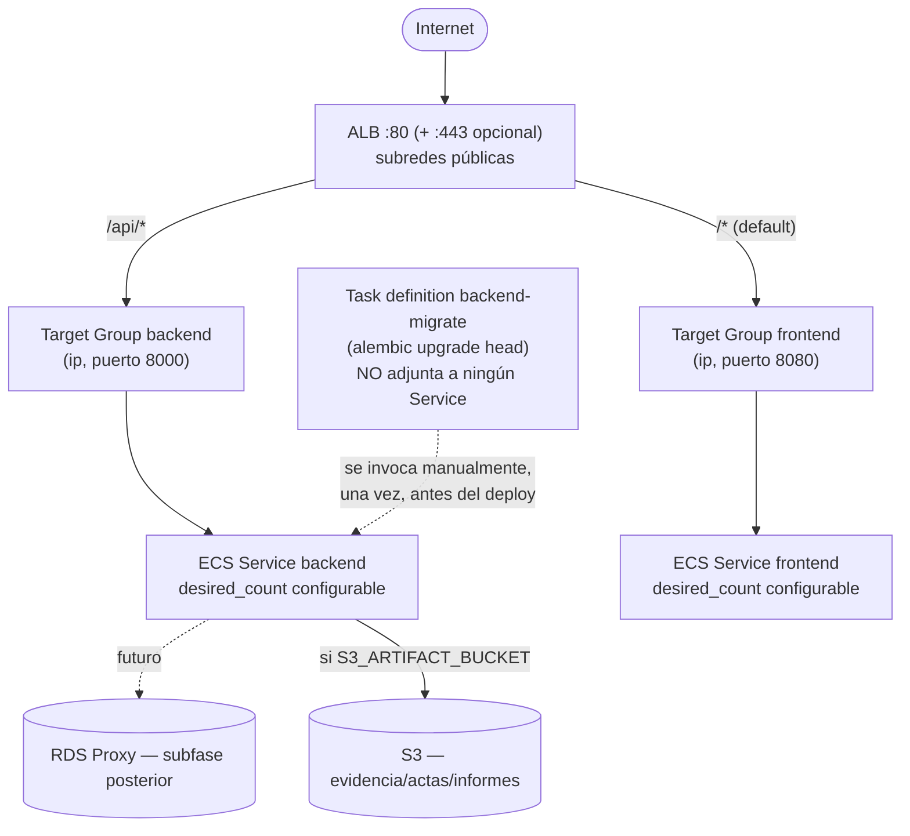

# ECS/Fargate + ALB — Fase 4C.2

Este documento describe lo que Fase 4C.2 creó como código en `infra/terraform/`: la capa de ejecución (ECS/Fargate) y el punto de entrada público (ALB) para Territorio Electoral. Complementa [`TERRAFORM_FOUNDATION.md`](./TERRAFORM_FOUNDATION.md) (red y security groups, Fase 4C.1) y sigue el destino descrito en [`PRODUCTION_ARCHITECTURE.md`](./PRODUCTION_ARCHITECTURE.md). **Ningún recurso de AWS existe todavía** — no se ejecutó `terraform apply` ni `terraform plan`.

## Diagrama



## Decisión: backend y frontend como dos ECS Services independientes

`docker-compose.prod.yml` (la topología que hoy corre en Render) ya trata backend y frontend como **dos contenedores separados**, cada uno con su propio `Dockerfile`, su propio health check y su propio ciclo de vida — nunca combinados en una sola imagen. Esta fase traslada esa misma topología a ECS sin inventar nada nuevo: `aws_ecs_service.backend` y `aws_ecs_service.frontend`, cada uno con su propia task definition, target group, security group y política de autoscaling — item 20 ("no acoples su escalado al backend si no es necesario").

`PRODUCTION_ARCHITECTURE.md` (escrito en una fase anterior) documentaba CloudFront + S3 para el frontend como aspiración; ese documento mismo lo marca como placeholder ("ningún recurso... existe todavía"). Migrar el frontend a hosting estático es una decisión que cambiaría cómo se sirve la aplicación **hoy** (en Render) y no hay evidencia en el repositorio de que ya se haya tomado — por lo que 4C.2 no la fuerza aquí. El ECS Service del frontend es un traslado 1:1 de lo que `docker-compose.prod.yml` ya ejecuta; una migración a CloudFront+S3 queda como decisión explícita de una subfase posterior, no de esta.

## Routing del ALB: por qué el ALB divide el tráfico, no nginx

`frontend/nginx.conf` hoy hace el split internamente: `location /api/ { proxy_pass http://api:8000; ... }` para las rutas de API, `location / { try_files ... /index.html; }` para todo lo demás (la SPA). Ese `proxy_pass http://api:8000` depende de la resolución DNS de Docker Compose (el nombre de servicio `api`), un mecanismo que **no existe automáticamente** entre dos ECS Services independientes sin AWS Cloud Map/ECS Service Connect — explícitamente fuera de alcance de 4C.2.

En vez de introducir Service Connect, el ALB replica exactamente el mismo split que nginx ya hace hoy:

- `path_pattern = ["/api/*"]` → target group `backend`
- default action (todo lo demás) → target group `frontend`

Ningún comportamiento observable cambia para el cliente: las mismas rutas llegan al mismo destino que hoy. La consecuencia es que los `location /api/...` de `nginx.conf` quedan **inalcanzables** cuando se accede vía el ALB (el ALB intercepta `/api/*` antes de que la petición llegue al contenedor del frontend) — código inerte, no removido porque `nginx.conf` sigue siendo la fuente de verdad para Render/Docker Compose, que sí lo necesita. No se modificó ningún archivo de la aplicación para esta fase.

## ECS Cluster y Fargate

`aws_ecs_cluster` + `aws_ecs_cluster_capacity_providers` registrando `["FARGATE", "FARGATE_SPOT"]` (item 5). Nunca EC2-backed ECS. El peso por defecto de cada servicio es 100% `FARGATE` on-demand (`fargate_spot_weight_percent = 0`); `FARGATE_SPOT` queda disponible como capacidad opcional/documentada vía esa variable, pero **nunca** puede ser el 100% de un servicio (el resto del peso siempre cae en `FARGATE`). Container Insights queda deshabilitado — corresponde a la subfase de CloudWatch (Fase 4C.4).

## IAM: Execution Role vs. Task Role

Dos roles con propósitos deliberadamente distintos (item 6/7):

| Rol | Quién lo usa | Qué permite | Cómo |
| --- | --- | --- | --- |
| **Execution Role** (`aws_iam_role.execution`) | ECS, para arrancar el contenedor | Pull de imagen (ECR), escribir logs (CloudWatch Logs) | Política administrada de AWS `AmazonECSTaskExecutionRolePolicy` (ARN universal, no específico del proyecto) — nada más. Si `secrets_manager_secret_arns` no está vacío, se añade `secretsmanager:GetSecretValue` **solo** sobre esos ARNs |
| **Task Role** (`aws_iam_role.task`) | El código de la aplicación en tiempo de ejecución (boto3, Fase 4A) | Nada por defecto. Si `s3_artifact_bucket` no está vacío: `s3:PutObject/GetObject/DeleteObject/CopyObject/HeadObject` sobre `<bucket>/evidence/*` y `<bucket>/reports/*` — idéntico a la tabla IAM de `PRODUCTION_ARCHITECTURE.md` | Sin claves AWS estáticas nunca; el mismo credential provider chain de boto3 que ya usa `app/services/s3_client.py` |

Ningún permiso se concede preventivamente: sin `secrets_manager_secret_arns` no hay política de Secrets Manager; sin `s3_artifact_bucket` no hay política de S3.

**Actualización (Fase 4C.7)**: en 4C.2 ambos roles de esta tabla eran compartidos por los cuatro Task Definitions (`backend`, `backend_migrate`, `backend_bootstrap`, `frontend`) — el frontend heredaba formalmente el Task Role con permisos S3 y el Execution Role con acceso a `secretsmanager:GetSecretValue` sobre los secretos de DB, aunque nunca los invocaba (nginx no ejecuta AWS SDK ni declara `secrets`). La auditoría de 4C.7 corrigió esto: `aws_iam_role.task` se renombró a `aws_iam_role.backend_task` (mismos permisos, ahora exclusivo de la familia backend), y el frontend recibió su propio `aws_iam_role.frontend_execution` (misma política administrada, sin la policy de secretos) y ya no declara `task_role_arn` en absoluto — ver `PRODUCTION_READINESS.md` y `modules/ecs/main.tf`.

## Task Definitions

- **`backend`**: Fargate, `awsvpc`, `cpu`/`memory` configurables (256/512 por defecto). Contenedor `api`, puerto configurable (8000). **El `command` sobreescribe el `CMD` del Dockerfile** para arrancar únicamente `uvicorn`, sin `alembic upgrade head` — ver "Estrategia de migraciones" abajo. `healthCheck` a nivel de contenedor idéntico al que ya usa `docker-compose.prod.yml`.
- **`backend-migrate`**: misma imagen, mismo entorno, mismos roles que `backend`, pero `command = "exec alembic upgrade head"` y **no está adjunta a ningún `aws_ecs_service`** — ver abajo.
- **`frontend`**: Fargate, `awsvpc`, contenedor `frontend`, puerto configurable (8080), `healthCheck` idéntico al `HEALTHCHECK` de `frontend/Dockerfile`. Sin variables de entorno: nginx no consume ninguna en runtime (su configuración se hornea en la imagen).

## Estrategia de migraciones (Alembic)

Fase 4B ya demostró el problema real: dos réplicas ejecutando `alembic upgrade head` en paralelo compiten por crear `alembic_version` (reproducido en `docker-compose.multi-instance.yml`). Esta fase aplica la corrección que `DEPLOYMENT.md`/`PRODUCTION_ARCHITECTURE.md` ya documentaban como pendiente:

1. **`aws_ecs_task_definition.backend_migrate`** existe como recurso Terraform, pero nunca se asocia a un `aws_ecs_service` — nada la ejecuta automáticamente, no registra target group, y no necesita IP pública (una task definition `awsvpc` no fija su propia red: quien la invoca vía `run-task` decide subredes/security group, igual que un `aws_ecs_service`).
2. El flujo manual/futuro-pipeline es: **(a)** invocarla una vez, en las mismas subredes privadas de aplicación y el mismo security group que usa el backend (nunca subredes públicas ni `assignPublicIp=ENABLED`):

   ```bash
   aws ecs run-task \
     --cluster "$(terraform output -raw ecs_cluster_name)" \
     --task-definition "$(terraform output -raw backend_migrate_task_definition_arn)" \
     --launch-type FARGATE \
     --network-configuration "awsvpcConfiguration={subnets=[$(terraform output -json app_subnet_ids | jq -r 'join(",")')],securityGroups=[\"$(terraform output -raw ecs_tasks_security_group_id)\"],assignPublicIp=DISABLED}"
   ```

   **(b)** confirmar que terminó con exit code 0 — `command = ["/bin/sh", "-c", "exec alembic upgrade head"]` usa `exec`, así que el proceso de Alembic reemplaza al shell: el exit code del contenedor **es** el exit code real de Alembic (no queda enmascarado por el shell), visible tanto en `aws ecs describe-tasks` (`containers[].exitCode`) como en el log group `backend-migrate`; **(c)** solo entonces actualizar/desplegar `aws_ecs_service.backend` con la nueva imagen.
3. Nunca debe haber dos ejecuciones de esta task definition corriendo a la vez contra la misma base — igual que hoy solo `api-a` migra en `docker-compose.multi-instance.yml`.
4. El mismo mecanismo de `secrets_manager_secret_arns` que alimenta al backend alimenta a esta task (comparten los locals `backend_environment`/`backend_secrets`): cuando exista la infraestructura de Secrets Manager, ambas quedan cableadas sin cambios adicionales.

Automatizar este flujo (un paso de pipeline que invoque `run-task` y espere su resultado antes de continuar) queda fuera de 4C.2, tal como el enunciado de la fase permite ("puede quedar preparada/documentada sin implementar todavía un pipeline completo").

## Application Load Balancer

Único punto público hacia los servicios ECS — `aws_lb.this`, en las subredes públicas de 4C.1, usando el `alb` security group ya creado en 4C.1 (sin modificarlo). Dos target groups (`target_type = "ip"`, obligatorio para Fargate):

| Target group | Puerto | Health check | Por qué |
| --- | --- | --- | --- |
| `backend` | 8000 | `GET /api/v1/health` | Liveness, nunca toca la base de datos. **Deliberadamente no `/api/v1/ready`**: ese endpoint sí consulta la DB, y usarlo como health check del target group haría que el ALB deje de enrutar tráfico (o que ECS reemplace la task) ante una caída transitoria de la base — justo lo que el split `/health`/`/ready` de Fase 4B evita a nivel de contenedor. `/ready` sigue existiendo y disponible para otros usos (un chequeo manual, un futuro gate de despliegue) — simplemente no conduce el health check automático del target group |
| `frontend` | 8080 | `GET /health` | El mismo endpoint que ya usa el `HEALTHCHECK` de `frontend/Dockerfile` |

### Listeners

- **HTTP :80**: siempre existe. Sin `certificate_arn` (por defecto): reenvía directamente (`/api/*` → backend, resto → frontend) — "base técnica configurable" del item 12, sin inventar dominio ni certificado. Con `certificate_arn`: redirige todo a HTTPS 301.
- **HTTPS :443**: solo se crea si `certificate_arn` no está vacío (`count`). `ssl_policy = "ELBSecurityPolicy-TLS13-1-2-2021-06"`. Mismo routing por path que el listener HTTP.

No se creó ningún certificado ACM ni se hardcodeó ningún dominio.

## Health check grace period

`health_check_grace_period_seconds` (backend: 60s, frontend: 30s por defecto) le da a cada task tiempo para completar su arranque (pull de imagen, import de la aplicación) antes de que ECS actúe sobre un resultado de health check desfavorable del ALB. Como el target group del backend usa `/api/v1/health` (nunca toca la DB), este grace period protege el arranque del **proceso**, no una base de datos lenta — la resiliencia ante una DB lenta/caída ya la cubre `pool_pre_ping`/`pool_recycle` (Fase 4B) durante la vida de la task, no el arranque.

## Deployment

`deployment_minimum_healthy_percent = 100` / `deployment_maximum_percent = 200` (configurables): con `desired_count = 1`, ECS levanta una segunda task en paralelo durante un despliegue en vez de tumbar la única task existente — sin downtime forzado, sin arquitectura blue/green. `deployment_circuit_breaker { enable = true, rollback = true }`: si el nuevo deployment no llega a estabilizarse, ECS revierte automáticamente a la revisión anterior de la task definition.

## Autoscaling base

`aws_appautoscaling_target` + `aws_appautoscaling_policy` (target tracking) por servicio, usando la métrica predefinida `ECSServiceAverageCPUUtilization` — sin depender de métricas custom de CloudWatch. `min_capacity`/`max_capacity` configurables (1/4 por defecto), `target_value` de CPU configurable (70% por defecto). Se usa únicamente CPU, no CPU+memoria simultáneas: dos políticas de target tracking sobre el mismo servicio pueden competir entre sí y producir oscilación de escalado (anti-patrón documentado de AWS) — memoria puede añadirse en una subfase posterior si el dimensionamiento real (Fase 4C.6) lo justifica. Sin escalado ilimitado: `max_capacity` siempre tiene un tope explícito.

## Logging

`awslogs` mínimo: un `aws_cloudwatch_log_group` por task definition (`backend`, `frontend`, `backend-migrate`), retención configurable (30 días por defecto). Sin dashboards, alarms, métricas avanzadas ni metric filters — eso es Fase 4C.4.

## Networking y security groups

- **ALB**: subredes públicas, security group de 4C.1 sin modificar.
- **ECS backend**: subredes privadas de aplicación, `assign_public_ip = false`, security group `ecs_tasks` de 4C.1 (sin cambios — ya permitía exactamente el puerto del backend desde el ALB).
- **ECS frontend**: subredes privadas de aplicación, `assign_public_ip = false`, **security group nuevo** (`frontend_tasks`, creado en el módulo `ecs`) — ver razón abajo.
- Egress hacia registry/AWS APIs/S3: vía NAT Gateway y el VPC Endpoint de S3, ambos ya definidos en Fase 4C.1 — sin cambios a esa estrategia.
- La cadena `ECS -> RDS Proxy -> RDS` de 4C.1 no se tocó (RDS/RDS Proxy no existen todavía).

### Por qué el frontend tiene su propio security group

El SG `ecs_tasks` de 4C.1 se documentó y se implementó con alcance específico a la API (`description = "...de la API"`, ingress limitado al puerto del backend). Ampliarlo para aceptar también el puerto del frontend mezclaría el blast radius de dos servicios con ciclos de vida y despliegues independientes. En vez de eso, este módulo crea `frontend_tasks` (mismo patrón de reglas separadas que 4C.1, sin ciclos) y añade **una regla de egress nueva en el security group del ALB** (`alb_to_frontend`, puerto 8080) — esa regla vive físicamente en el módulo `ecs` mientras referencia el SG del ALB por su ID (recibido como variable desde 4C.1); **ningún archivo del módulo `security_groups` de 4C.1 se modificó**.

## Variables y secretos (extiende la tabla de `TERRAFORM_FOUNDATION.md`)

| Categoría | Variables de esta fase | Notas |
| --- | --- | --- |
| No sensible, con default razonable | `app_env`, `web_concurrency`, `backend_task_cpu/memory`, `*_desired_count`, `*_min/max_capacity`, `*_cpu_target_value`, `deployment_*`, `*_health_check_grace_period_seconds`, `log_retention_days`, `db_name`, `db_user`, `fargate_spot_weight_percent`, `artifact_storage_provider` (default `s3`, ver nota abajo) | Configurables en `terraform.tfvars`, sin secretos |
| Obligatorias, sin default (no se inventan) | `backend_image`, `frontend_image`, `frontend_origins`, `browser_allowed_origins`, `trusted_hosts`, `db_host` | Requieren un valor real (imagen de un registry, dominio real, endpoint real de DB) antes de cualquier `plan`/`apply` |
| Secreto (interfaz preparada, no infraestructura todavía) | `secrets_manager_secret_arns` (mapa nombre→ARN) | Vacío por defecto. Cuando exista la infraestructura de Secrets Manager (subfase posterior), basta con pasar este mapa — la task definition y el permiso IAM ya están cableados |
| Provisto por infraestructura futura | `s3_artifact_bucket` (subfase S3), `db_host` (subfase RDS/RDS Proxy), `certificate_arn` (subfase de dominio/ACM) | Todas vacías/sin default hoy |

`artifact_storage_provider` por defecto es `"s3"` — el único valor productivo para ECS/Fargate (Fase 4A ya implementa `S3ArtifactStorage`, credenciales exclusivamente vía el Task Role/credential provider chain de boto3, nunca `AWS_ACCESS_KEY_ID`/`AWS_SECRET_ACCESS_KEY`). Como el bucket todavía no es un recurso de este Terraform, `s3_artifact_bucket` sigue sin default: con el valor por defecto (`s3` + bucket vacío), **`terraform plan`/`apply` fallan explícitamente** por el `precondition` de `aws_ecs_service.backend` en `modules/ecs/main.tf` — no un `CrashLoopBackOff` silencioso en ECS. Ese mismo `precondition` bloquea la otra combinación inválida: `artifact_storage_provider = "local"` con `backend_desired_count > 1` (cada task tendría su propio filesystem, no compartido — evidencia/informes inconsistentes entre réplicas). `terraform validate` no evalúa estos preconditions (dependen de valores concretos, no solo de tipos) — sigue en verde con los valores por defecto; son `plan`/`apply` los que los harían fallar, y ninguno de los dos se ejecutó en esta fase.

### Task Role → S3: permisos exactos, derivados del código real

`s3:CopyObject` y `s3:HeadObject` **no son acciones IAM válidas** — son operaciones de la API de S3 sin una acción IAM independiente propia; AWS las autoriza a través de otros permisos. Una revisión detectó que la policy original de esta fase las incluía como si fueran acciones IAM reales; se corrigió antes del commit. El mapeo real, verificado contra cada llamada boto3 en `backend/app/services/artifact_storage.py::S3ArtifactStorage` (único punto del backend que llama al cliente S3 — confirmado por búsqueda en todo `backend/app`):

| Operación boto3 | Método (línea) | Permiso IAM requerido |
| --- | --- | --- |
| `put_object` | `store()` | `s3:PutObject` |
| `head_object` | `delete()`, `exists()`, `head_metadata()` (×3) | `s3:GetObject` — `HeadObject` no tiene acción IAM propia; AWS la autoriza con `GetObject` |
| `delete_object` | `delete()`, `promote_pending()` (×2) | `s3:DeleteObject` |
| `generate_presigned_url("get_object", ...)` | `download()` | `s3:GetObject` — la identidad que **firma** la URL necesita el permiso que la URL autoriza a quien la use |
| `generate_presigned_post` | `presign_upload()` (Direct Upload de actas, Fase 4A) | `s3:PutObject` — mismo razonamiento que arriba |
| `copy_object` | `promote_pending()` (copia server-side `pending/` → `final/`, mismo bucket) | `s3:GetObject` sobre el origen + `s3:PutObject` sobre el destino — `CopyObject` tampoco tiene acción IAM propia |

Sin `list_objects_v2`, sin multipart upload — ninguno de los dos aparece en el código, por lo tanto sin `s3:ListBucket` ni permisos de multipart.

La policy final que recibe el Task Role (nunca el Execution Role) cuando `s3_artifact_bucket` está configurado:

```json
{
  "Effect": "Allow",
  "Action": ["s3:GetObject", "s3:PutObject", "s3:DeleteObject"],
  "Resource": [
    "arn:aws:s3:::<bucket>/<s3_evidence_prefix>/*",
    "arn:aws:s3:::<bucket>/<s3_report_prefix>/*"
  ]
}
```

`s3_evidence_prefix`/`s3_report_prefix` (default `"evidence"`/`"reports"`, igual que `backend/app/core/config.py`) alimentan **a la vez** las variables de entorno `S3_EVIDENCE_PREFIX`/`S3_REPORT_PREFIX` del contenedor y los `Resource` de esta policy — una sola fuente de verdad, nunca duplicada a mano entre el entorno del contenedor y el IAM. `evidence/pending/*` y `evidence/final/*` (los sub-prefijos que usa el flujo de Direct Upload de actas) ya quedan cubiertos por el comodín `evidence/*`, sin reglas adicionales. Sin `s3:*`, sin `Resource: "*"`, sin permisos KMS (el default `s3_sse_mode = "AES256"` no usa una CMK propia — añadir `kms:Decrypt`/`Encrypt`/`GenerateDataKey` sería prematuro sin esa decisión tomada).

Ni `s3:*`, ni `Resource = "*"`, ni acceso a ningún otro prefijo del bucket — idéntico a la tabla IAM ya documentada en `PRODUCTION_ARCHITECTURE.md` desde Fase 4A. Sin `s3_artifact_bucket` (vacío), esta política ni siquiera se crea (`count = var.s3_artifact_bucket == "" ? 0 : 1`).

## Estrategia de imágenes

`backend_image`/`frontend_image` son variables de tipo `string`, sin default. No se inventó ningún repositorio ECR, cuenta de AWS ni URL — `terraform.tfvars.example` documenta el formato esperado con placeholders entre `<ángulos>` (`<AWS_ACCOUNT_ID>.dkr.ecr.<AWS_REGION>.amazonaws.com/...`), nunca un valor que parezca real. Un pipeline futuro (fuera de alcance de 4C.2) debe proveer imágenes inmutables — por digest o por tag de commit — nunca `:latest` en producción.

## Costos adicionales de esta fase (complementa la tabla de `TERRAFORM_FOUNDATION.md`)

| Recurso | Costo | Notas |
| --- | --- | --- |
| ALB | Por hora + por LCU | Uno solo, compartido por ambos servicios |
| ECS/Fargate (backend + frontend) | Por vCPU/memoria-hora de cada task en ejecución | Escala con `desired_count` × tamaño de task × (1 + spot%/100 con descuento) |
| CloudWatch Logs | Ingesta + almacenamiento, 3 log groups | Retención configurable (`log_retention_days`) |
| Application Auto Scaling | Sin costo propio | Cambia el número de tasks facturadas según CPU |

Nada de esto se ha creado — no se ejecutó `terraform apply`.

## Riesgos y decisiones a revisar

1. **CloudFront+S3 para el frontend vs. ECS Service**: decisión explícita de esta fase (ver arriba); revisar si el roadmap real de Fase 4C quiere migrar el frontend a hosting estático más adelante.
2. **`s3_artifact_bucket` sin default**: el bucket no es un recurso de este Terraform todavía (subfase posterior) — hasta entonces, cualquier `plan`/`apply` real con `artifact_storage_provider = "s3"` (el valor por defecto) fallará por el `precondition` de `aws_ecs_service.backend` hasta que se provea. Es el comportamiento deseado (falla explícita en vez de un backend que arranca roto), pero implica que 4C.2 por sí sola no es deployable de punta a punta — necesita la subfase de S3 (o, como salida temporal documentada, `artifact_storage_provider = "local"` con `backend_desired_count = 1`).
3. **Rutas `/api/...` inertes en `nginx.conf`** cuando se accede vía el ALB: documentado arriba, sin riesgo funcional, pero puede confundir a quien lea `nginx.conf` sin este contexto.
4. **`fargate_spot_weight_percent = 0` por defecto**: conservador a propósito; subir el peso de Spot es una decisión de costo/resiliencia para revisar en Fase 4C.6, no aquí.
5. **Egress HTTPS `0.0.0.0/0` del nuevo SG `frontend_tasks`**: mismo trade-off ya documentado en `TERRAFORM_FOUNDATION.md` para `ecs_tasks` — candidato a restringirse a prefix lists de AWS en una subfase posterior.
6. **Automatización del release task de Alembic**: hoy es un `aws ecs run-task` manual documentado, no un paso de pipeline. Automatizarlo es trabajo pendiente, no bloqueante para 4C.2.

## Validación local

Mismo procedimiento que `TERRAFORM_FOUNDATION.md`, ahora cubriendo también `modules/alb` y `modules/ecs`:

```bash
cd infra/terraform/environments/prod
terraform init -backend=false
terraform validate
terraform fmt -check -recursive ../../..
```
