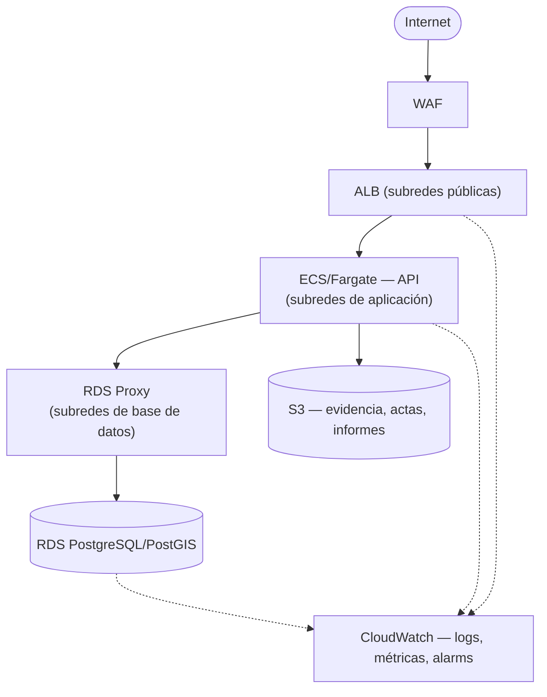

# Fundación Terraform AWS — Fase 4C.1

Este documento describe **lo que Fase 4C.1 realmente creó como código**: la fundación de Terraform (red + security groups) para el destino descrito en [`docs/aws/PRODUCTION_ARCHITECTURE.md`](./PRODUCTION_ARCHITECTURE.md). Ese otro documento sigue siendo la referencia del **estado objetivo completo** (ALB, ECS, RDS Proxy, RDS, S3, CloudWatch, Secrets Manager); este documento cubre solo la porción ya escrita en `infra/terraform/` — VPC, subredes, NAT y security groups — y cómo validarla.

**Ningún recurso de AWS existe todavía.** No se ejecutó `terraform apply`, no se usaron credenciales de AWS, y esta fase no lo requiere.

## Diagrama objetivo (flujo de tráfico completo)

Estado final hacia el que esta fundación apunta — no todo lo dibujado aquí existe como recurso Terraform todavía (ver "Por qué solo fundación" abajo y la tabla de componentes en `PRODUCTION_ARCHITECTURE.md`):



Líneas continuas: tráfico de aplicación (el que los security groups de esta subfase ya delimitan). Líneas punteadas: observabilidad (CloudWatch), que llega en una subfase posterior.

## Por qué "solo fundación" en 4C.1

Fase 4C completa (Terraform, ECS/Fargate, ALB, RDS + RDS Proxy, WAF, CloudWatch, lifecycle S3, load testing, dimensionamiento, backup/DR, runbook) es demasiado grande para una sola subfase. 4C.1 entrega la base que todas las subfases siguientes van a componer: estructura de repositorio, provider/versiones, red y límites de seguridad. ALB, ECS, RDS, RDS Proxy, WAF y CloudWatch se implementan como módulos nuevos en subfases posteriores, consumiendo los outputs que esta fundación ya expone (`vpc_id`, subredes por nivel, security groups).

## Arquitectura de red creada

```
VPC (10.20.0.0/16 por defecto, configurable)

  AZ A                              AZ B
  ├─ public   (ALB, futuro)         ├─ public   (ALB, futuro)
  ├─ app      (ECS/Fargate, futuro) ├─ app      (ECS/Fargate, futuro)
  └─ db       (RDS/RDS Proxy, fut.) └─ db       (RDS/RDS Proxy, fut.)
```

- **public**: `map_public_ip_on_launch = true`, ruta a Internet vía Internet Gateway. Único destino previsto: el ALB.
- **app**: sin IP pública. Ruta a Internet solo vía NAT Gateway (saliente, para pulls de imagen ECR, llamadas a APIs de AWS no cubiertas por VPC endpoints, etc.). Destino previsto: las tasks ECS/Fargate de la API.
- **db**: sin IP pública y **sin ninguna ruta a Internet** — la única ruta en su route table es la `local` que AWS agrega automáticamente para el CIDR de la VPC. Destino previsto: RDS y RDS Proxy.

Un **VPC Endpoint (Gateway) hacia S3** está asociado a las route tables de `app` y `db`: el tráfico ECS → S3 (evidencia, actas, informes — ya implementado en Fase 4A, ver `PRODUCTION_ARCHITECTURE.md`) permanece dentro de la red de AWS en vez de salir por el NAT Gateway. Los Gateway Endpoints no tienen costo por hora ni por GB propio.

### NAT Gateway: `single_nat_gateway`

Variable booleana, `true` por defecto:

- `true`: un único NAT Gateway compartido por todas las AZs. Menor costo fijo; sin embargo, si esa AZ tiene un incidente, la salida a Internet de **todas** las subredes `app` se pierde (aunque el propio VPC endpoint de S3 sigue funcionando, ya que no depende del NAT).
- `false`: un NAT Gateway por AZ. Alta disponibilidad real; costo proporcional al número de AZs.

Ver "Costos" más abajo para el orden de magnitud.

## Security groups creados

```
Internet
   │
  [ALB security group]      ingress 443/80 desde alb_ingress_cidr_blocks (0.0.0.0/0 por defecto)
   │  egress → puerto de la API, solo hacia ECS tasks SG
   ▼
  [ECS tasks security group] ingress solo desde ALB SG, en el puerto de la API
   │  egress → puerto DB, solo hacia RDS Proxy SG
   │  egress → 443, hacia 0.0.0.0/0 (APIs de AWS / hosts públicos que la app consulta explícitamente)
   ▼
  [RDS Proxy security group] ingress solo desde ECS tasks SG, en el puerto DB
   │  egress → puerto DB, solo hacia RDS SG
   ▼
  [RDS security group]       ingress SOLO desde RDS Proxy SG, en el puerto DB. Sin egress. Nunca 0.0.0.0/0.
```

El security group **por defecto** de la VPC (el que AWS crea automáticamente junto con toda VPC nueva) queda explícitamente sin reglas — cualquier recurso futuro creado sin especificar un security group propio no hereda ningún acceso de red por omisión.

### Por qué reglas separadas y no bloques `ingress`/`egress` inline

Cada `aws_security_group` se crea sin reglas propias (`ingress = []`, `egress = []`); todas las reglas reales son recursos independientes `aws_vpc_security_group_ingress_rule` / `aws_vpc_security_group_egress_rule`. Es la única forma de que dos security groups se referencien mutuamente (el egress del ALB necesita el ID del SG de ECS, y el ingress de ECS necesita el ID del SG del ALB) sin crear un ciclo de dependencias irresoluble en el grafo de Terraform. El bloque `ingress = [] / egress = []` explícito también elimina la regla de egress "permitir todo" que AWS agrega por defecto a todo security group nuevo, de forma que el tráfico saliente de cada uno queda exclusivamente definido por las reglas explícitas.

## Variables y secretos

Clasificación de la configuración actual de la aplicación (`backend/app/core/config.py`, `backend/.env.production.example`) de cara a cómo se suministrará en ECS:

| Categoría | Ejemplos | Cómo se suministra en Fase 4C |
| --- | --- | --- |
| **No sensible** | `APP_ENV`, `APP_DEBUG`, `ENABLE_API_DOCS`, `WEB_CONCURRENCY`, `DB_POOL_*`, `BROWSER_COOKIE_SAMESITE`, `FRONTEND_ORIGINS`, `BROWSER_ALLOWED_ORIGINS`, `TRUSTED_HOSTS`, `TERRITORY_AI_PROVIDER`, `METRICS_ENABLED`, `ARTIFACT_STORAGE_PROVIDER`, `S3_EVIDENCE_PREFIX`, `S3_REPORT_PREFIX`, `S3_SSE_MODE` | Variables de entorno normales en la definición de la ECS task (o `terraform.tfvars` de un módulo futuro) |
| **Secreto** | `SECRET_KEY`, `BROWSER_REFRESH_TOKEN_HMAC_SECRET`, `SURVEY_SUBMISSION_HMAC_SECRET`, `POSTGRES_PASSWORD`/`DATABASE_URL`, `INITIAL_ADMIN_PASSWORD`, `METRICS_TOKEN` (cuando `METRICS_ENABLED=true`) | AWS Secrets Manager, referenciado desde la ECS task definition como `secrets` (nunca como `environment` en texto plano, nunca en Terraform ni en `.tfvars`) |
| **Provisto por infraestructura** | `POSTGRES_HOST` (endpoint de RDS Proxy), `S3_ARTIFACT_BUCKET` (nombre real del bucket), `AWS_REGION` | Output de los módulos de una subfase posterior (RDS, S3), inyectado a la ECS task definition — no hay credenciales estáticas: la aplicación ya usa el credential provider chain estándar de boto3 (`app/services/s3_client.py`), por lo que en ECS basta con una IAM Task Role |
| **Específico de entorno** | `aws_region`, `vpc_cidr`, `single_nat_gateway`, `alb_ingress_cidr_blocks` | `terraform.tfvars` de `environments/prod` (sin secretos, versionable) |

No se implementa todavía integración con Secrets Manager en Terraform (ni el propio recurso `aws_secretsmanager_secret`): no hace falta hasta que exista una ECS task definition real que los consuma. Esta tabla es la referencia para cuando se cree.

## Terraform state

**Hoy: state local**, sin bloque `backend` en `versions.tf`. Esto es deliberado para que `terraform init -backend=false` (y de hecho `terraform init` a secas) funcione sin ningún recurso de AWS preexistente ni credenciales — requisito explícito de Fase 4C.1.

**Recomendación para antes de cualquier `apply` real contra AWS**: backend `s3` con locking nativo (`use_lockfile = true`, sin necesidad de una tabla DynamoDB adicional en versiones recientes de Terraform), bucket versionado y cifrado (SSE-S3 o SSE-KMS), `Block Public Access` activo en las 4 opciones — el mismo estándar que ya se documenta para el bucket de artifacts en `PRODUCTION_ARCHITECTURE.md`. Ese bucket de state es en sí mismo infraestructura ("bootstrap"): no puede crearse con el propio Terraform que lo va a usar como backend (problema del huevo y la gallina) — se crea una única vez, manualmente o con un Terraform de bootstrap aparte con state local, y después se referencia desde `environments/prod/versions.tf`. No se crea en esta subfase.

## Configuración por entorno

Solo existe `environments/prod`. El proyecto no tiene hoy un entorno staging/dev real (Render staging usa `docker-compose.prod.yml`, no AWS) — crear `environments/staging` sin un despliegue real detrás sería un módulo ficticio. Cuando exista esa necesidad, se añade un directorio `environments/<nombre>` hermano que reutiliza los mismos `modules/`, con su propio `terraform.tfvars`.

## Costos con impacto permanente (orden de magnitud, sin dimensionar — eso es Fase 4C.6)

| Recurso | Costo | Notas |
| --- | --- | --- |
| **NAT Gateway** | Cargo por hora + por GB procesado, por cada NAT Gateway | `single_nat_gateway = true` (por defecto) crea solo uno; `false` crea uno por AZ |
| **ALB** | Cargo por hora + por LCU (unidades de capacidad) | Aún no creado (subfase posterior) |
| **ECS/Fargate** | Por vCPU/memoria-hora de cada task en ejecución | Aún no creado; costo escala con réplicas × tamaño de task |
| **RDS PostgreSQL/PostGIS (Multi-AZ)** | Por hora de instancia (× 2 por Multi-AZ) + almacenamiento + I/O | Aún no creado |
| **RDS Proxy** | Por hora + por capacidad de conexión provisionada | Aún no creado |
| **WAF** | Cargo mensual por Web ACL + por regla + por millón de solicitudes | Aún no creado |
| **CloudWatch** | Ingesta y almacenamiento de logs, métricas custom, alarms | Aún no creado |
| **VPC Endpoint S3 (Gateway)** | Sin costo propio | Ya definido en esta subfase — reduce, no añade, costo de NAT |
| **Elastic IP (NAT)** | Sin costo mientras está asociada a un NAT Gateway en uso | Ya definido en esta subfase |

Nada de la tabla anterior se ha creado salvo el VPC Endpoint S3 y las Elastic IP del NAT Gateway (ambas sin costo propio en su forma de uso aquí) — y ninguno de los dos se ha aplicado tampoco, ya que no se ejecutó `terraform apply`.

## Riesgos y decisiones a revisar

1. **WAF: ¿delante del ALB directamente, o delante de CloudFront?** `PRODUCTION_ARCHITECTURE.md` describe CloudFront + WAF delante de un frontend estático en S3, con `/api/*` hacia el ALB. El diagrama de esta subfase (pedido explícitamente en Fase 4C.1) simplifica a `WAF → ALB` directo. Ambos son compatibles con la red ya creada (AWS WAF soporta asociarse tanto a un Web ACL de CloudFront como a uno de ALB); la decisión se toma en la subfase que cree el ALB/WAF real, no aquí.
2. **Egress HTTPS de ECS tasks a `0.0.0.0/0`** (`ecs_https_egress` en `modules/security_groups`): necesario hoy porque ECS necesita alcanzar APIs de AWS (ECR, CloudWatch, Secrets Manager, STS) y hosts públicos que la propia aplicación consulta explícitamente (`PUBLIC_FETCH_*`, ver `backend/app/core/config.py`). Podría restringirse a prefix lists administradas de AWS (`com.amazonaws.<region>.*`) en una subfase posterior si se decide cerrar más ese egress; no se hizo aquí para no introducir una lista de prefijos incompleta sin evidencia de qué hosts públicos concretos necesita la app en producción.
3. **Un solo NAT Gateway por defecto** (`single_nat_gateway = true`): trade-off costo/disponibilidad explícito, documentado arriba — cambiar a `false` antes de producción real si el runbook de disponibilidad (Fase 4C.7) lo exige.
4. **Subred de RDS Proxy**: esta subfase no crea RDS Proxy todavía, por lo que su ubicación final (subredes `db` reutilizadas, o subredes `app`) queda para cuando se implemente ese módulo — el security group ya está preparado para cualquiera de las dos opciones.
5. **`aws_default_security_group`**: bloquear el security group por defecto de la VPC es un cambio de alcance de VPC completo (no solo de los recursos que Terraform gestiona). Es una práctica estándar de higiene de seguridad, pero conviene que quien revise confirme que ningún otro proceso fuera de este Terraform asume el comportamiento por defecto de ese security group.

## Validación local

Ver [`infra/terraform/README.md`](../../infra/terraform/README.md) para los comandos exactos. Terraform no estaba instalado en el entorno donde se escribió esta fundación — la validación de sintaxis se hizo manualmente (revisión de HCL) y con `terraform` no disponible se deja documentado como limitación explícita; quien tenga Terraform instalado debe correr `terraform fmt -check -recursive`, `terraform init -backend=false` y `terraform validate` antes de dar esta subfase por completamente verificada.
