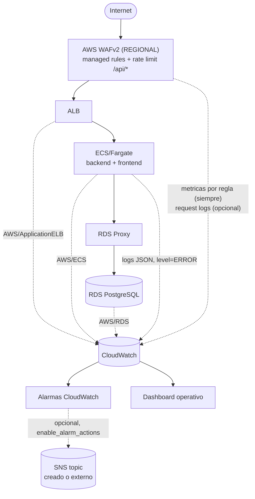

# AWS WAF + CloudWatch / Observabilidad — Fase 4C.4

Este documento describe lo que Fase 4C.4 creó como código en `infra/terraform/`: la capa de protección perimetral (WAF) y observabilidad (CloudWatch) para Territorio Electoral. Complementa [`TERRAFORM_FOUNDATION.md`](./TERRAFORM_FOUNDATION.md), [`ECS_ALB_FOUNDATION.md`](./ECS_ALB_FOUNDATION.md) y [`RDS_PROXY_FOUNDATION.md`](./RDS_PROXY_FOUNDATION.md). **Ningún recurso de AWS existe todavía** — no se ejecutó `terraform apply` ni `terraform plan`.

## Diagrama



## Auditoría de observabilidad existente (antes de crear nada nuevo)

| Ya existe | Dónde | Qué aporta |
| --- | --- | --- |
| Logging JSON estructurado | `backend/app/core/observability.py::JsonFormatter` | Cada línea de log es un objeto JSON con `timestamp`, `level`, `logger`, `request_id`, `message`, y campos opcionales (`method`, `path`, `status_code`, `duration_ms`, etc.) — base para el metric filter de errores de esta fase |
| Redacción de datos sensibles | `SensitiveDataFilter` (misma clase) | Redacta claves con forma `token|authorization|cookie|password|secret|presigned|signature|database_url` y patrones `Bearer ...`, JWT, `X-Amz-Signature`, `postgresql://...` del mensaje — revisado en esta fase (ver "Datos sensibles en logs" abajo), sin defecto encontrado |
| `request_id` de punta a punta | Middleware en `backend/app/main.py` + `request_id_context` | Generado/validado por request, devuelto en `X-Request-ID`, incluido en cada línea de log — ya listo para CloudWatch Logs Insights filtrando por ese campo |
| Métricas de aplicación (Prometheus) | `backend/app/core/observability.py::prometheus_metrics()`, expuesto en `/api/v1/metrics` | Contadores de bajo cardinality (`territorio_events_total{event=...}`) — formato Prometheus, **no** consumible por CloudWatch sin un agente/exporter adicional (ver "Application metrics" abajo) |
| `/api/v1/health` / `/api/v1/ready` | `backend/app/api/routes/health.py` | Ya usados como health check del target group del backend (Fase 4C.2) |
| Log groups ECS | `modules/ecs/main.tf` | **4** ya existentes: `backend`, `frontend`, `backend-migrate`, `backend-bootstrap` (el cuarto se agregó en la revisión de producción de Fase 4C.3, no en 4C.2 como podría asumirse) — todos con `retention_in_days = var.log_retention_days`, ya configurable. No se duplicó ninguno |
| Container Insights | `modules/ecs/main.tf`, `aws_ecs_cluster.this` | Fijo en `"disabled"` desde Fase 4C.2 — esta fase lo hace configurable (`container_insights_enabled`), default sin cambios |
| Autoscaling ECS | `modules/ecs/main.tf` | Ya consume `AWS/ECS` `CPUUtilization` vía `ECSServiceAverageCPUUtilization` (Application Auto Scaling) — confirma que ese namespace/métrica son reales antes de reutilizarlos en las alarmas de esta fase |
| RDS Performance Insights | `modules/database/variables.tf`, Fase 4C.3 | Ya configurable (`db_performance_insights_enabled`, default `false`) — sin duplicar, solo referenciado aquí |

Ninguna de estas piezas se modificó salvo por las tres ampliaciones mínimas descritas abajo.

## Arquitectura implementada

```
Internet → WAFv2 (REGIONAL) → ALB → ECS/Fargate → RDS Proxy → RDS
```

- **`modules/waf`**: `aws_wafv2_web_acl` + `aws_wafv2_web_acl_association` (al ALB existente) + logging opcional.
- **`modules/observability`**: alarmas CloudWatch (ALB, ECS, RDS, log-based), dashboard, SNS opcional.
- **Ampliaciones mínimas a módulos existentes**: `modules/alb` (access logs opcionales), `modules/ecs` (Container Insights configurable), `modules/database` (RDS log exports opcionales) — ninguna reestructuración, solo nuevas variables con default igual al comportamiento previo.

## WAF Web ACL

`scope = "REGIONAL"` (protege el ALB directamente — no existe CloudFront en esta arquitectura, ver `ECS_ALB_FOUNDATION.md`). `default_action { allow {} }`: la política normal es permitir; las reglas bloquean/limitan únicamente lo que coincide con sus condiciones — un `default deny` exigiría modelar explícitamente cada patrón de tráfico válido de la aplicación, fuera de alcance y de riesgo injustificado aquí.

### Metrics, logging y sampled requests: tres mecanismos distintos

Revisión de producción explícita sobre este punto — no confundir:

| Mecanismo | Argumento Terraform | Qué contiene | Estado en esta fase |
| --- | --- | --- | --- |
| **Métricas CloudWatch** | `visibility_config.cloudwatch_metrics_enabled` | Contadores agregados por regla (cuántas solicitudes coincidieron) — **sin contenido de solicitud** | **Siempre `true`**, en las 4 reglas y a nivel de Web ACL — nunca se desactiva, nunca configurable |
| **WAF request logging** | `aws_wafv2_web_acl_logging_configuration` (`waf_logging_enabled`) | Solicitudes completas (headers, query string, etc.) enviadas a un log group | Opcional, default `false`; si se habilita, con `redacted_fields` (ver abajo) |
| **Sampled requests** | `visibility_config.sampled_requests_enabled` | Una muestra de hasta ~5000 solicitudes reales (~3h), consultable vía consola/API `GetSampledRequests` — **contenido de solicitud real**, igual que el logging | `var.waf_sampled_requests_enabled`, **default `false`** |

**`redacted_fields` de `aws_wafv2_web_acl_logging_configuration` NO protege los sampled requests** — son mecanismos completamente separados de AWS WAF; redactar el logging no redacta la muestra. AWS ofrece un mecanismo dedicado para proteger sampled requests (`aws_wafv2_web_acl.data_protection_config`), **no implementado en esta fase** — no es necesario mientras `sampled_requests_enabled` permanezca en su default seguro (`false`). Si en el futuro se necesita depurar falsos positivos con sampled requests activos de forma sostenida, `data_protection_config` debe evaluarse en ese momento, no implementarse especulativamente ahora.

### Managed rule groups

| Rule group | Priority | Propósito | Riesgo de falso positivo |
| --- | --- | --- | --- |
| `AWSManagedRulesCommonRuleSet` | 1 | Protección genérica de aplicación web (XSS, LFI, técnicas comunes) | **Documentado**: la aplicación acepta texto libre de ciudadanos (necesidades, incidentes) que podría coincidir con patrones genéricos de XSS/SQLi — monitorear la métrica `${name_prefix}-common-rule-set` tras cualquier uso real antes de confiar ciegamente en el bloqueo |
| `AWSManagedRulesKnownBadInputsRuleSet` | 2 | Bloquea firmas de exploits conocidos (ej. Log4Shell) | Bajo — firmas específicas, no patrones genéricos |
| `AWSManagedRulesAmazonIpReputationList` | 3 | Bloquea IPs con reputación maliciosa confirmada (inteligencia de amenazas de AWS) | Muy bajo |

Los tres son `bool` configurables (`waf_enable_common_rule_set`, etc., default `true` los tres). Deliberadamente **no** se agregaron todos los managed rule groups disponibles (ej. `SQLiRuleSet` es redundante con Common; `AdminProtectionRuleSet`/`LinuxRuleSet`/`WindowsRuleSet` no tienen justificación clara para esta aplicación) — evita coste y falsos positivos innecesarios (item 7).

### Rollout de Managed Rule Groups: Count → Enforce

**Estado actual verificado (no supuesto)**: antes de esta revisión, los 3 managed rule groups usaban `override_action { none {} }` — es decir, **ya bloqueaban** según la acción interna de cada regla de AWS (típicamente `Block`), sin observación previa. Esta revisión lo corrige.

`var.waf_managed_rules_count_mode` (**default `true`**) controla `override_action` de los 3 rule groups, vía bloques `dynamic`:

```hcl
override_action {
  dynamic "count" { for_each = var.waf_managed_rules_count_mode ? [1] : [] ; content {} }
  dynamic "none"  { for_each = var.waf_managed_rules_count_mode ? [] : [1] ; content {} }
}
```

**Semántica exacta de `override_action { count {} }`** (verificada, no asumida): cuando se aplica sobre una regla que envuelve un `managed_rule_group_statement`, sustituye la acción de **todas** las reglas internas de ese managed rule group por Count — el grupo completo evalúa y genera métrica/log, pero **ninguna** de sus reglas internas bloquea nada. Esto es distinto de `rule_action_override` (un mecanismo más granular para cambiar la acción de reglas internas *individuales*, que requiere conocer sus nombres exactos dentro del managed rule group) — **no se usa aquí** porque esos nombres no se pudieron verificar con evidencia en este entorno; usar `override_action` a nivel de grupo completo es la implementación más simple compatible con el provider ya resuelto (confirmado con `terraform validate` real) que permite un rollout de Count seguro sin inventar nombres internos de AWS.

**Proceso recomendado** (documentado, no automatizado):
1. Desplegar con `waf_managed_rules_count_mode = true` (default).
2. Observar métricas por regla (`${name_prefix}-common-rule-set`, etc.) — y logs si `waf_logging_enabled = true` — durante tráfico real.
3. Identificar falsos positivos **concretos**, no hipotéticos.
4. Si hacen falta excepciones específicas, agregarlas con esa evidencia real (fuera de alcance definirlas aquí sin ella).
5. Cambiar a `waf_managed_rules_count_mode = false` (enforcement real).
6. Seguir monitoreando las métricas tras el cambio.

### Rate limiting

`rate_based_statement`, priority 4, `aggregate_key_type = "IP"`, `evaluation_window_sec = 300` (**explícito en el código**, no implícito — confirmado que el provider AWS 5.100.0 ya resuelto soporta este argumento), `limit = var.waf_rate_limit_requests` (default **2000** solicitudes/IP/5min, sin cambios en esta revisión — el tuning es Fase 4C.6). Acotado a `/api/*` vía `scope_down_statement` (`byte_match_statement`, `STARTS_WITH` sobre `uri_path`, valor `/api/` — el mismo prefijo que ya usa el routing del ALB, `modules/alb`, `path_pattern = ["/api/*"]`, nunca inventado). Motivo de acotar solo a `/api/*` (item 10): la API es la superficie que realmente golpea backend/DB por solicitud; los assets estáticos del frontend son cacheables por el navegador, y su patrón de tráfico (ráfagas de carga de página) no debería competir por el mismo presupuesto de tasa que las llamadas transaccionales.

**Acción confirmada: `action { block {} }`** — la rate rule bloquea (no cuenta) cuando se excede el límite. Apropiado para un baseline conservador y bien documentado, no un rollout tipo Count (a diferencia de los managed rule groups, un rate limit generoso como 2000/5min tiene un riesgo de falso positivo mucho menor y más predecible).

**Naturaleza aproximada del rate limiting de AWS WAF (documentado explícitamente)**:
- El conteo se evalúa sobre una ventana deslizante de 300s con la latencia de propagación propia de WAF — **no** es un limitador exacto de 6.67 req/s; es una aproximación diseñada para detectar abuso evidente, no para modelar tráfico de negocio preciso.
- Una regla por IP **agrupa a usuarios detrás de la misma IP pública/NAT** corporativo — un umbral demasiado bajo bloquearía tráfico legítimo (item 45).
- **No es, y no debe convertirse en, un mecanismo de rate limiting de negocio/autenticación** (ej. límite de intentos de login por usuario) — eso es una responsabilidad de la aplicación, no de WAF.

### WAF y health checks (item 44)

**Sin excepciones agregadas, y no hacían falta**: los health checks del target group del ALB hacia los targets ECS son verificaciones internas del propio ALB contra los targets registrados — **no atraviesan el pipeline de listener/WAF** que sí procesa el tráfico público entrante. WAF únicamente inspecciona solicitudes que llegan a los listeners del ALB desde clientes reales; no puede, por diseño de AWS, bloquear ese tráfico interno de health-check.

### WAF logging: destino y redacción

`aws_wafv2_web_acl_logging_configuration` — opcional (`waf_logging_enabled`, default `false`). Si se habilita:

- **Destino**: `aws_cloudwatch_log_group` dedicado, nombre `aws-waf-logs-${name_prefix}` — **prefijo exigido por AWS** (no es una convención de este proyecto; un log group de WAF logging debe empezar literalmente con `aws-waf-logs-`), distinto de los log groups de `backend`/`frontend`/`backend-migrate`/`backend-bootstrap` (nunca reutilizados) y sin ninguna relación con el bucket de artifacts de usuarios. Retención configurable (`log_retention_days`, misma variable que el resto de la fundación). Sin Kinesis Data Firehose ni S3 — CloudWatch Logs es el destino más simple que AWS soporta nativamente, suficiente para esta fase.
- **Redacción** (`redacted_fields`, nuevo en esta revisión): dos campos, verificados contra el código real de autenticación de la aplicación, no inventados:

  | Campo redactado | Evidencia en el código |
  | --- | --- |
  | `single_header { name = "authorization" }` | `backend/app/services/auth_service.py` — tokens Bearer/JWT para clientes API; ya redactado en los logs de aplicación por `SensitiveDataFilter` |
  | `single_header { name = "cookie" }` | `backend/app/services/browser_auth_service.py` + `backend/app/core/config.py` (`browser_cookie_secure`, `browser_access_token_minutes`, `browser_refresh_token_days`) — sesiones de navegador vía cookies HttpOnly |

  **Sin redacción de `query_string`**: se revisó el código del backend buscando un mecanismo de token/secreto transportado por query string en solicitudes *entrantes* y no se encontró ninguno (el único `access_token` del código es un campo de un cuerpo de **respuesta** JSON, `browser_auth_service.py`, no un query param de una solicitud) — no se redacta especulativamente lo que no está evidenciado. **Sin redacción de `uri_path`**: sin necesidad identificada.

  `redacted_fields` **no** protege los sampled requests (ver arriba) — son mecanismos separados de AWS WAF.

**Filtrado de logging (item 10 de esta revisión)**: se evaluó si limitar qué solicitudes se registran (`logging_filter`, existe en el provider) reduciría ruido/coste. **Diferido**: con `waf_logging_enabled = false` por defecto, no hay ruido/coste que reducir todavía; implementar `logging_filter` sin una necesidad concreta (qué se querría excluir, y por qué) sería complejidad sin justificación — queda como optimización posterior, no una limitación de seguridad.

### Outputs

`web_acl_arn`, `web_acl_id`, `web_acl_name`, `association_id`, `log_group_name` (o `null`) — nada sensible.

## Container Insights

`container_insights_enabled` (default `false`, sin cambio de comportamiento respecto a Fase 4C.2). Si se habilita, usa el valor `"enabled"` (no `"enhanced"`, el modo más reciente de AWS — no se pudo verificar con certeza su nombre/comportamiento exacto en este entorno sin acceso a consola/documentación de AWS; `"enabled"` es el valor histórico, ampliamente documentado). Las alarmas de CPU/memoria de ECS de esta fase **no dependen** de Container Insights — usan el namespace estándar `AWS/ECS`, ya en uso por Application Auto Scaling desde Fase 4C.2.

## Log groups y retención

Los 4 log groups de ECS (`backend`, `frontend`, `backend-migrate`, `backend-bootstrap`) ya existían con retención configurable (`log_retention_days`, default 30 días) — no se duplicó ninguno. Esta fase agrega:
- `aws-waf-logs-<prefijo>` (solo si `waf_logging_enabled = true`), misma variable de retención.

Ningún log group usa retención infinita por defecto — decisión explícita, documentada aquí por impacto en costos (ver abajo).

## Alarmas CloudWatch

Todas las métricas usadas se verificaron contra el schema real del provider AWS 5.100.0 (`terraform providers schema -json`) para los **atributos Terraform** (`namespace`, `metric_name`, `dimensions` como argumentos válidos de `aws_cloudwatch_metric_alarm`) — Terraform no valida que una métrica exista realmente en CloudWatch (`terraform validate` no lo hace, ver item 49), así que la existencia real de cada métrica se basa en documentación de AWS ampliamente conocida y estable, no en una llamada a la API de CloudWatch (no disponible sin credenciales en esta fase).

**`datapoints_to_alarm` explícito (revisión de esta ronda)**: las 13 alarmas fijan `datapoints_to_alarm` igual a su `evaluation_periods` (M de N, con M=N) — antes quedaba implícito (CloudWatch aplica ese mismo default cuando se omite); ahora el código deja visible que **todos** los periodos consecutivos deben incumplir el umbral, no solo alguno.

### ALB (`AWS/ApplicationELB`)

| Alarma | Métrica | `statistic` | Dimensiones | `period` × `evaluation_periods`/`datapoints_to_alarm` | Umbral (default) | `treat_missing_data` |
| --- | --- | --- | --- | --- | --- | --- |
| `alb-5xx` | `HTTPCode_ELB_5XX_Count` | `Sum` | `LoadBalancer` | 60s × 5/5 | > 10 | `notBreaching` (sin 5xx ≠ problema) |
| `alb-target-5xx-backend` | `HTTPCode_Target_5XX_Count` | `Sum` | `LoadBalancer`, `TargetGroup` (backend) | 60s × 5/5 | > 10 | `notBreaching` |
| `alb-response-time-backend` | `TargetResponseTime` | `Average` | `LoadBalancer`, `TargetGroup` (backend) | 60s × 5/5 | > 2s | `notBreaching` |
| `alb-unhealthy-hosts-backend` | `UnHealthyHostCount` | `Maximum` | `LoadBalancer`, `TargetGroup` (backend) | 60s × 5/5 | > 0 | `missing` (ambiguo, mantener estado) |
| `alb-unhealthy-hosts-frontend` | `UnHealthyHostCount` | `Maximum` | `LoadBalancer`, `TargetGroup` (frontend) | 60s × 5/5 | > 0 | `missing` |

**Statistics revisadas explícitamente (item 11-12 de esta ronda), confirmadas correctas**:
- `Sum` para los conteos de errores 5xx — son eventos que se acumulan, no un nivel instantáneo.
- `Average` para `TargetResponseTime` — latencia promedio del periodo; percentiles (`p90`, etc.) quedan como refinamiento de Fase 4C.6, no necesarios para este baseline.
- **`Maximum`, no `Sum`, para `UnHealthyHostCount`** — confirmado explícitamente correcto: esta métrica representa un *nivel* (cuántos targets están unhealthy en un instante), no un evento acumulable; `Sum` la trataría erróneamente como si fuera un conteo de eventos. `Maximum` sobre el periodo asegura no diluir un problema real que solo duró unos segundos dentro del minuto — más seguro que `Average` para una señal de "¿hubo algún target unhealthy?".

**`UnHealthyHostCount`, detalle completo** (item 12 de esta ronda): `statistic=Maximum`, `period=60s`, `evaluation_periods=5`, `datapoints_to_alarm=5`, `threshold=0` (`GreaterThanThreshold`), `treat_missing_data=missing`. Los 5 periodos consecutivos (5 minutos sostenidos) son deliberados para no generar ruido durante un rolling deployment normal, donde un target puede quedar unhealthy brevemente mientras el nuevo despliegue se estabiliza — sin cambios en esta revisión, ya reflejaba esto correctamente.

**`HealthyHostCount`: solo en el dashboard, nunca como alarma** (item 13 de esta ronda) — evita dos alarmas generando exactamente la misma señal desde ángulos opuestos (un target sano de menos ⇔ un target no sano de más). El widget del dashboard muestra ambas métricas (`HealthyHostCount` y `UnHealthyHostCount`) porque aportan contexto visual distinto para un humano — cuántos targets sanos hay en total, no solo si hay alguno insano — pero solo `UnHealthyHostCount` dispara una alarma real.

### ECS (`AWS/ECS`)

| Alarma | Métrica | Dimensiones | Umbral (default) | `treat_missing_data` |
| --- | --- | --- | --- | --- |
| `ecs-backend-cpu-high` / `ecs-frontend-cpu-high` | `CPUUtilization` | `ClusterName`, `ServiceName` | Average > 85% / 3×300s | `notBreaching` |
| `ecs-backend-memory-high` / `ecs-frontend-memory-high` | `MemoryUtilization` | `ClusterName`, `ServiceName` | Average > 85% / 3×300s | `notBreaching` |

`treat_missing_data = "notBreaching"`: un servicio momentáneamente sin tasks (deploy) no debe alarmar solo por el hueco de métricas — y `evaluation_periods=3` sobre 300s (15 min sostenidos) evita que autoscaling (que ya reacciona a la misma métrica) y esta alarma "se pisen" generando ruido redundante durante un evento de escalado normal (item 21/22).

**Running task count (item 23) — limitación documentada, no inventada**: el namespace estándar `AWS/ECS` (sin Container Insights) no expone de forma fiable un conteo de tasks en ejecución por servicio; esa granularidad requiere el namespace `ECS/ContainerInsights` (`RunningTaskCount`), solo disponible si `container_insights_enabled = true`. En vez de inventar o asumir el nombre de una métrica no verificada, el síntoma real que "menos tasks saludables de lo esperado" produce —menos targets sanos registrados en el ALB— ya queda cubierto por las alarmas `alb-unhealthy-hosts-*` de arriba, con métricas confirmadas.

**Confirmado en esta ronda de revisión (item 14-15)**: `namespace = "AWS/ECS"` con dimensiones exactas `ClusterName`/`ServiceName` para `CPUUtilization`/`MemoryUtilization` — válido para ECS Services sobre Fargate (no depende de EC2). Estas 4 alarmas **no dependen** de `container_insights_enabled`: siguen funcionando igual con Container Insights deshabilitado (el default), porque `AWS/ECS` es el namespace estándar, distinto de `ECS/ContainerInsights` (que sí requeriría la feature activada). Ninguna alarma básica de esta fase depende de Container Insights.

### RDS (`AWS/RDS`)

| Alarma | Métrica | Umbral (default) | `treat_missing_data` |
| --- | --- | --- | --- |
| `rds-cpu-high` | `CPUUtilization` | Average > 80% / 3×300s | `breaching` |
| `rds-free-storage-low` | `FreeStorageSpace` | Average < 20% de `db_allocated_storage` (bytes, calculado, no absoluto) / 3×300s | `breaching` |
| `rds-freeable-memory-low` | `FreeableMemory` | Average < 256 MiB / 3×300s | `breaching` |
| `rds-database-connections-high` | `DatabaseConnections` | Average > 80 / 3×300s | `notBreaching` |

`treat_missing_data = "breaching"` para CPU/storage/memoria: RDS es un recurso siempre activo (no efímero como una task ECS) — ausencia sostenida de métricas de una instancia que debería existir es en sí misma una señal de alerta. `DatabaseConnections` usa `notBreaching`: pocas/ninguna conexión en el periodo no es un problema por sí mismo.

**`FreeStorageSpace`, sin presuponer 20 GiB (item 25)**: el umbral se calcula como `db_allocated_storage_gib × rds_free_storage_threshold_percent / 100`, tomando el `allocated_storage` real configurado (Fase 4C.3), no un valor fijo — si ese tamaño cambia, la alarma se recalcula automáticamente en el próximo `apply`.

**`DatabaseConnections` — implicación de RDS Proxy (item 26)**: el tráfico normal del backend pasa por RDS Proxy (pooling, Fase 4C.3), no conecta directo a RDS — esta métrica cuenta las conexiones que **RDS Proxy** (y las tasks de bootstrap/migración, que sí conectan directo) mantienen contra RDS, no conexiones de aplicación 1:1. El umbral (80) es un valor genérico documentado como tal, sin relación verificada con el `max_connections` real de `db_instance_class` — ajuste definitivo: Fase 4C.6.

**Confirmado en esta ronda de revisión (item 16)**: `namespace = "AWS/RDS"`, `dimensions = { DBInstanceIdentifier = ... }` en las 4 alarmas. `FreeStorageSpace`/`FreeableMemory` — CloudWatch entrega ambas en **bytes**; los umbrales de esta fase ya están calculados en bytes (`rds_free_storage_threshold_percent` es solo el *insumo* del cálculo — `db_allocated_storage_gib × 1024³ × pct/100` — nunca se compara un porcentaje directo contra una métrica en bytes; `rds_freeable_memory_threshold_mb × 1024²` convierte MiB a bytes antes de la comparación). Sin unidades inventadas.

### RDS Proxy — no implementado, limitación documentada (item 28)

**No se agregó ninguna alarma ni widget de dashboard para RDS Proxy.** Motivo explícito: no fue posible verificar con evidencia (el schema del provider Terraform no encapsula el catálogo de métricas de CloudWatch — solo valida que `namespace`/`metric_name` sean strings, nunca que existan realmente) el namespace y los nombres exactos de métrica de RDS Proxy en este entorno, sin acceso a documentación/consola de AWS. Inventar `client_connections`, `database_connections`, `borrow_latency` u otros nombres plausibles sin esa verificación violaría directamente la instrucción de esta fase de no inventar métricas. **Seguimiento**: verificar en Fase 4C.6/operación real contra la consola de AWS (CloudWatch → Métricas → buscar por `ProxyName`) o `aws cloudwatch list-metrics` una vez exista una instancia real, y agregar las alarmas correspondientes en ese momento con nombres confirmados.

### Log-based metric (item 30)

`aws_cloudwatch_log_metric_filter.backend_errors`: patrón `{ $.level = "ERROR" }` sobre el log group del backend — sintaxis JSON nativa de CloudWatch Logs (no un regex frágil sobre texto libre), posible porque `JsonFormatter` (Fase 4B) ya emite `level` como campo JSON de primer nivel en cada línea. Alimenta `TerritorioElectoral/Backend/ErrorLogCount`, con una alarma (`Sum > 10 / 300s`, `treat_missing_data = notBreaching`).

**No se agregó un metric filter para fallos de migración**: la migration task es de un solo uso, no un servicio continuo — un "conteo de errores por periodo" no es el modelo correcto para algo que corre una vez y termina; el mecanismo ya documentado (`ECS_ALB_FOUNDATION.md`: confirmar exit code 0 tras `aws ecs run-task`) sigue siendo la forma correcta de verificarlo. Evita "convertir todos los logs en métricas" (item 30).

## Evidencia de que las métricas usadas son válidas (item 19/49)

1. **`AWS/ECS` `CPUUtilization`**: ya consumida por `aws_appautoscaling_policy` (`ECSServiceAverageCPUUtilization`, Fase 4C.2) — si no existiera, el autoscaling ya creado no podría funcionar. Confirma el namespace y la dimensión `ServiceName`/`ClusterName`.
2. **Atributos Terraform** (`namespace`, `metric_name`, `dimensions`, `statistic`, `treat_missing_data`, etc. de `aws_cloudwatch_metric_alarm`; bloques de `aws_wafv2_web_acl`; `arn_suffix` de `aws_lb`/`aws_lb_target_group`; `enabled_cloudwatch_logs_exports` de `aws_db_instance`): verificados contra `terraform providers schema -json` del provider AWS 5.100.0 ya resuelto — no adivinados.
3. **Nombres de métrica AWS/ApplicationELB, AWS/ECS, AWS/RDS**: documentación pública de AWS ampliamente conocida y estable desde hace años (`HTTPCode_ELB_5XX_Count`, `HTTPCode_Target_5XX_Count`, `TargetResponseTime`, `HealthyHostCount`/`UnHealthyHostCount`, `CPUUtilization`, `MemoryUtilization`, `FreeStorageSpace`, `DatabaseConnections`, `FreeableMemory`) — no verificable contra una llamada real a CloudWatch en este entorno sin credenciales, pero de confianza suficientemente alta por su universalidad y estabilidad histórica.
4. **RDS Proxy**: precisamente por no alcanzar ese mismo nivel de confianza, se omitió por completo — ver arriba.

## Dashboard

`aws_cloudwatch_dashboard` (`modules/observability/dashboard.tf`), nombre determinista `${name_prefix}-operations`, `dashboard_body` construido con `jsonencode()` a partir de una lista de widgets Terraform — sin account IDs hardcodeados, todas las dimensiones vienen de outputs de otros módulos (`arn_suffix`, `cluster_name`, `service_name`, `db_instance_id`). 9 widgets, organizados por categoría: ALB (errores 5xx, latencia, hosts no saludables, hosts saludables), ECS backend (CPU/memoria), ECS frontend (CPU/memoria), RDS (CPU/conexiones, storage/memoria libre), y errores del backend (log-based metric). Ningún widget de RDS Proxy — misma razón que las alarmas.

## SNS para alarmas

`create_alarm_sns_topic` (bool, default `false`) crea `aws_sns_topic.alarms`; alternativamente `alarm_sns_topic_arn` (string, default `""`) referencia un topic externo ya existente. **Mutuamente excluyentes**, validado con una `validation` block cruzada (`!(create_alarm_sns_topic && alarm_sns_topic_arn != "")`) — evita el conflicto entre ambos modos que pedía el item 33. `local.alarm_topic_arn` resuelve cuál usar (o cadena vacía si ninguno). **Sin direcciones de correo ni endpoints reales hardcodeados en ningún lado** — las suscripciones (email, etc.) sobre el topic resultante se administran manualmente, fuera de este Terraform.

`enable_alarm_actions` (default `false`) y `enable_ok_actions` (default `false`), independientes entre sí — en validación/desarrollo Terraform no se quieren notificaciones reales (item 34/35); ambos deliberadamente apagados por defecto incluso si existe un topic.

## Datos sensibles en logs (item 40) — revisión, sin defecto encontrado

Se revisó `backend/app/core/observability.py` (ya auditado arriba) y los call sites de `logger.*` en `backend/app/main.py` — el middleware solo registra `method`, `path`, `status_code`, `duration_ms`; nunca headers completos, cuerpo de la solicitud, ni `Authorization`. `SensitiveDataFilter` ya redacta proactivamente cualquier clave con forma sospechosa y patrones `Bearer .../JWT/postgresql://` del mensaje, como defensa en profundidad. **No se encontró ningún defecto real de filtración de passwords/tokens/cookies/DB URLs en los logs — no se modificó ningún archivo de `backend/`.**

## ALB access logs (item 41) — configurable, diferido

`modules/alb`: nueva variable `access_logs_bucket` (default `""` = deshabilitados). Si se provee el nombre de un bucket S3 **ya existente** (con la bucket policy que exige el servicio de ALB — distinta por región, no gestionada por este Terraform), se habilita `access_logs { bucket, prefix, enabled = true }`. **No se creó ningún bucket S3 nuevo en esta fase** — hacerlo (incluida su bucket policy, versionado, cifrado, lifecycle) amplía significativamente el alcance y pertenece a la subfase de Lifecycle S3. **Nunca reutilizar el bucket de artifacts de usuarios** (evidencia/actas/informes, Fase 4A) para logs de infraestructura — mezclaría datos de usuarios con logs operativos.

## RDS log exports (item 42) — configurable, deshabilitado por defecto

`modules/database`: nueva variable `enabled_cloudwatch_logs_exports` (`list(string)`, default `[]`, con `validation` que solo permite `"postgresql"` — el único tipo de export válido para el engine `postgres`). Deshabilitado por defecto: los logs de PostgreSQL (queries, errores del motor) pueden ser verbosos y tienen costo de ingesta/almacenamiento propio en CloudWatch Logs — se documenta aquí en vez de activarse sin justificación concreta.

## Performance Insights (item 43) — sin duplicar

Ya configurable desde Fase 4C.3 (`db_performance_insights_enabled`, default `false`). Esta fase no lo modifica ni crea un recurso paralelo — si se habilita, complementa (no sustituye) las alarmas de CPU/memoria/conexiones de arriba con diagnóstico a nivel de query individual.

## Application metrics vs. infrastructure metrics (item 29)

| | Infrastructure metrics (esta fase) | Application metrics (Fase 4B, ya existentes) |
| --- | --- | --- |
| Qué miden | Recursos AWS (ALB, ECS, RDS) | Eventos de negocio (`territorio_events_total{event=...}`) |
| Formato | Nativo CloudWatch | Prometheus text exposition (`/api/v1/metrics`) |
| Consumible por CloudWatch hoy | Sí, directamente | **No**, sin un agente/exporter adicional (CloudWatch Agent con scraping de Prometheus, o un colector ADOT/OpenTelemetry) |
| Implementado en 4C.4 | Sí | No — evita una pipeline compleja sin justificación de alcance mínimo (item 29) |

Integrar las métricas de aplicación a CloudWatch queda documentado como mejora futura posible, no implementada aquí.

## Nomenclatura y tags

Mismo patrón que 4C.1-4C.3: `default_tags` del provider (`Project`, `Environment`, `ManagedBy`) + tag `Name` por recurso vía `merge(var.tags, {...})`. Ningún mecanismo de naming paralelo introducido.

## Costos con impacto permanente

### WAF (item 38)

| Componente | Costo |
| --- | --- |
| Web ACL | Cargo mensual fijo por Web ACL |
| Cada regla (3 managed rule groups + 1 rate-based) | Cargo mensual por regla |
| Solicitudes inspeccionadas | Cargo por millón de solicitudes |
| Managed rule groups | Algunos (no los usados aquí) tienen cargo adicional propio — los 3 elegidos son de nivel base, sin cargo adicional más allá del cargo por-regla estándar |

### CloudWatch (item 39)

| Componente | Costo | Notas |
| --- | --- | --- |
| Ingesta de logs | Por GB ingerido | Los 4 log groups de ECS ya existían; WAF logging (opcional, default apagado) agrega uno más solo si se habilita |
| Retención de logs | Por GB-mes almacenado | `log_retention_days` configurable, default 30 días — no infinita |
| Container Insights | Métricas custom + logs de rendimiento adicionales | Deshabilitado por defecto |
| Dashboard | 1 dashboard, dentro del tier gratuito típico (los primeros 3 dashboards/cuenta son gratis) | Sin costo adicional esperado a esta escala |
| Alarmas | Cargo por alarma-mes | 14 alarmas creadas |
| Métricas custom (log-based) | 1 métrica custom (`ErrorLogCount`) | Cargo menor por métrica custom |
| SNS | Solo si `create_alarm_sns_topic = true` | Cargo por notificación entregada, no por topic en sí |

Nada de esto se ha creado — no se ejecutó `terraform apply`.

## Troubleshooting básico

- **Una alarma está en `INSUFFICIENT_DATA` permanentemente**: revisar `treat_missing_data` de esa alarma específica (ver tablas arriba) y confirmar que el recurso dimensionado (ALB/ECS/RDS) efectivamente existe y está reportando al namespace esperado.
- **El Web ACL bloquea tráfico legítimo**: revisar primero las métricas por regla (`${name_prefix}-common-rule-set`, etc.) en CloudWatch para identificar cuál regla coincidió; considerar `waf_logging_enabled = true` temporalmente para ver las solicitudes bloqueadas reales antes de ajustar `override_action`/`rate_limit_requests`.
- **La alarma de conexiones RDS dispara sin explicación clara**: recordar que cuenta conexiones hacia RDS (desde RDS Proxy + bootstrap/migrate), no conexiones de aplicación 1:1 — revisar `db_proxy_max_connections_percent` (Fase 4C.3) antes de asumir un problema de la aplicación.

## Validación local

```bash
cd infra/terraform/environments/prod
terraform init -backend=false
terraform validate
terraform fmt -check -recursive ../../..
```
